<!-- TODO add table of contents -->
<!-- <h1 align="center"><span>🔥</span><br>Fireworks</h1>  -->
<!-- <p align="center">
<a href="https://clojars.org/io.github.paintparty/fireworks">
</img>
</a>
</p> -->

<h1 align="center">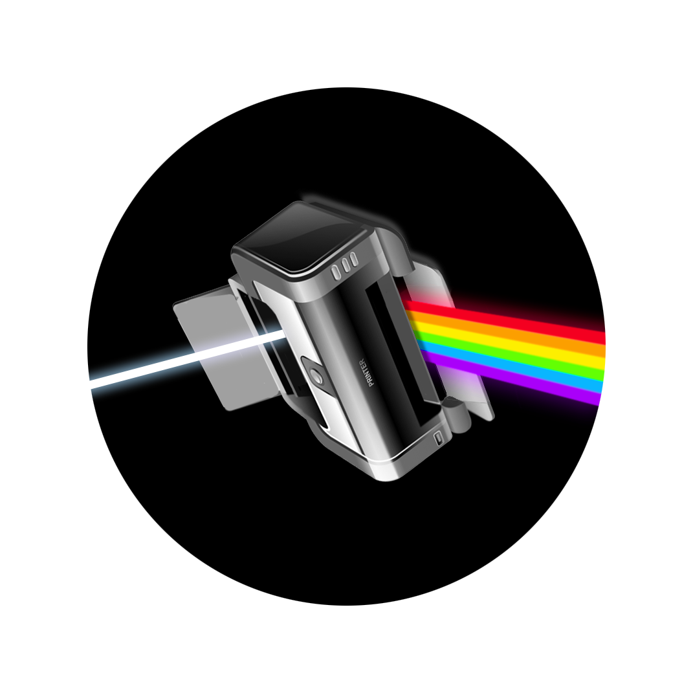</img><br>Fireworks</h1> 

<br>

<p align="center"><b>Print-and-return library for Clojure, ClojureScript, and Babashka.<br>Features color theming and rich typographic formatting.</b></p>

<br>

<p align="center">
<a href="https://clojars.org/io.github.paintparty/fireworks">
</img>
</a>
</p>

<br>

<div align="center">

**[Features]**  &nbsp;•&nbsp; **[Setup]**  &nbsp;•&nbsp;  **[Usage]** &nbsp;•&nbsp;  **[Options]** &nbsp;•&nbsp; **[Theming]** &nbsp;•&nbsp; **[Interop]** &nbsp;•&nbsp;  **[Contributing]**
</div>

[Features]: #features
[Setup]: #setup
[Usage]: #usage
[Options]: #options
[Theming]: #theming
[Interop]: #printing-conventions
[Contributing]: #contributing


<br>
<br>


## Why 
Fireworks is designed to make basic print debugging easier, faster, and more enjoyable. If you like the idea of printing observed values with formatting and syntax coloring that matches the source code in your editor, this tool may be of interest. 

<br>
<br>

## Features

- Ships with several popular themes in light and dark variants.

- Customizable via system-wide `.edn` config file.

- Easily themeable so you can visually match your source code as it appears in your favorite editor.

- Achieve thematic parity between editor, terminal emulator, and browser dev console.

- Makes cljs color printing possible in all dark-mode-themed browser consoles. 

- Left-justification of values in maps.

- High or low contrast rainbow brackets (optional).

- Truncation of collections and long values such as strings.

- Enhanced reflection for JS and Java values.

- Novel typographic approach for printing metadata inline, alongside values.

- Trace values in `let` bindings and threading macros such as `->`.

- Find and highlight values in printed output.

- Call site options let you easily try out different themes and formatting options.

<br>
<br>

<p align="center">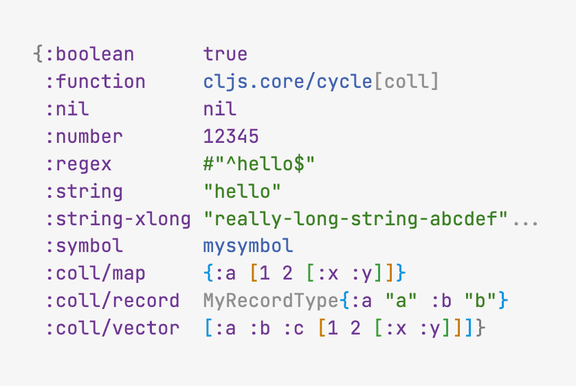</img></p>
<p align="center"><sub><b>Light and dark variants of <i> Alabaster, Neutral, Monokai, Solarized, Zenburn, and Degas.</i></b></sub></p>

<br>
<br>

## Setup

Requires Clojure `1.10.3` or higher

If using with Babashka, requires Babashka `v1.3.187` or higher

<br>

Add as a dependency to your project:


```clojure
[io.github.paintparty/fireworks "0.5.0"]
```
<br>

Import into your namespace:

```clojure
(ns myns.core
  (:require
    [fireworks.core :refer [?]]))
```
<br>
<br>

## Usage 
**`fireworks.core/?`** is a macro that prints the form, namespace info, and resulting value. It returns the resulting value.

```Clojure
(def x {:a "foo" :xyz "bar"})

(? x)
```
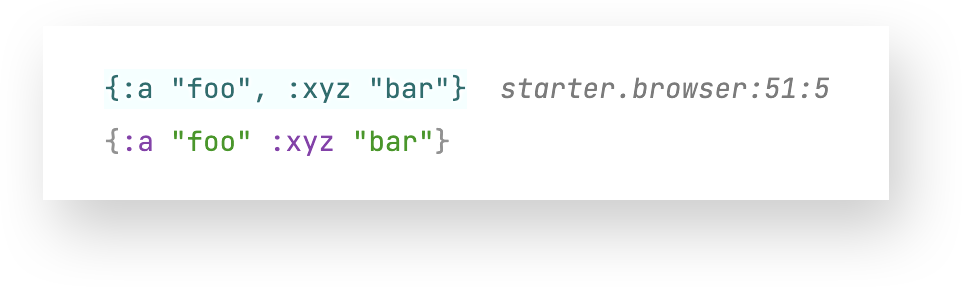


Calling **`fireworks.core/?`** with two arguments will print the namespace info, a label (instead of the form), and the result:

```Clojure
(? "My label" x)
```
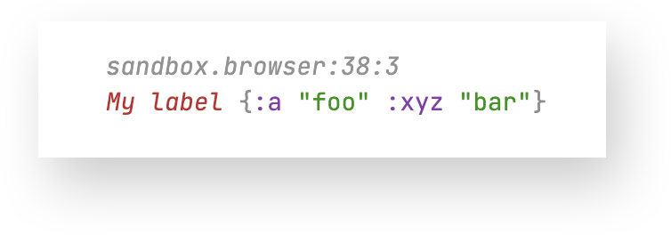


The first argument can also be a map, which supplies various [config options](#options):

```Clojure
(? {:label      "My label"
    :theme      "Monokai Light"
    :coll-limit 10}
   x)
```

<br>
<br>

### Print & return
Fireworks provides a bevy of print-and-return macros and functions so that you can print values from your source without altering the execution of your program.

`?`, `?log`, and `?pp` all print the evaled form (or user-supplied label), file info (line + column), and the result.

The variants with a single trailing dash, such as `?-`, just print the result.

<br>

Print and return  with Fireworks formatting (colorized & justified):<br>
`?` <br>
`?-` <br>

<br>

Print and return with Fireworks formatting (colorized & justified), with file info and no label:<br>
`?i` <br>

<br>

Print and return  with Fireworks formatting (colorized & justified), with label and no file info:<br>
`?l` <br>

<br>

Print and return with `js/console.log` or `pp/pprint` (JVM):<br>
`?log` <br>
`?log-` <br>

<br>

Print and return with [`pp/pprint`](https://github.com/eerohele/pp).<br>
`?pp` <br>
`?pp-` <br>

<br>

You can also just `tap>` & return the result, with no printing:<br>
`?>` <br>

<br>

You can use `?--` to print a label and file info. This is designed to add commentary for your program.<br>
`?--` <br>

<br>

All of the above functions have a respective "silencing" function, which will just return the result. This is useful if you want to leave something marked, but temporarily silence the printing:

`!?`<br>
`!?-`<br>
`!?i`<br>
`!?l`<br>
`!?log`<br>
`!?log-`<br>
`!?pp`<br>
`!?pp-`<br>
`!?>`<br>    

<br>

### Tracing
You can trace `let` bindings and threading macros with the following:

`?let`<br>
`?->`<br>
`?some->`<br>
`?->>`<br>
`?some->>`<br>


<br>

All the public macros and functions from `fireworks.core`:
```Clojure
[fireworks.core :refer [? !? ?- !?- ?-- !?-- ?> !?> ?i !?i ?l !?l ?log !?log ?log- !?log- ?pp !?pp ?pp- !?pp- ?let ?if-let ?when-let ?->> ?some->> ?-> ?some->]]
```
<br>

Currently, `?as->`, `?cond->`, `?cond->>`, and `?comp` do not exist, but they are on the roadmap for a future release.

<br>
<br>


### Getting the formatted string & other data

If you just want the formatted string, and/or other data that `fireworks.core/?` uses to construct the printed output, you can use the `fireworks.core/p-data` macro.

Calling `fireworks.core/p-data` in a ClojureScript (browser) context also provides vectors of css styles. This corresponds to the arguments that `js/console.log` requires for syntax-colored formatting. In a terminal context, `p-data` returns the same map as below, but with sgr escape codes for syntax coloring (instead of the `%c` tags), and no vectors of css styles:

```Clojure
;; ClojureScript

(p-data "foo")
=>
{:quoted-form   "foo",
 :formatted     {:string     "%c\"foo\"%c",
                 :css-styles ["color:#448C27;line-height:1.45;"
                              "color:#585858;line-height:1.45;"]},
 :file          "fireworks/core_test.cljc",
 :end-column    46,
 :ns-str        "fireworks.core-test",
 :file-info-str "fireworks.core-test:17:21",
 :column        21,
 :line          17,
 :end-line      17,
 :formatted+    {:string     "%cfireworks.core-test:17:21%c\n%c\"foo\"%c %c=>%c %c\"foo\"%c",
                 :css-styles ["color:#8c8c8c;font-style:italic;line-height:1.45;"
                              "color:#585858;line-height:1.45;"
                              "color:#448C27;line-height:1.45;"
                              "color:#585858;line-height:1.45;"
                              "color:#28cc7d;line-height:1.45;"
                              "color:#585858;line-height:1.45;"
                              "color:#448C27;line-height:1.45;"
                              "color:#585858;line-height:1.45;"]}}
```

<br>
<br>


## Options


For cutting & pasting into your [system-wide config](#system-wide-config), or trying things out at the call site: 

```Clojure
{:theme                         "Alabaster Light"
 :mood                          :light            ; :light | :dark
 :line-height                   1.45
 :print-level                   7
 :non-coll-length-limit         33
 :non-coll-mapkey-length-limit  20
 :non-coll-result-length-limit  444
 :non-coll-depth-1-length-limit 59
 :coll-limit                    15
 :evaled-form-coll-limit        7
 :display-namespaces?           true
 :metadata-print-level          7
 :display-metadata?             true
 :metadata-position             :inline           ; :inline | :block
 :enable-rainbow-brackets?      true
 :bracket-contrast              :high             ; :high | :low
 :enable-terminal-truecolor?    false
 :enable-terminal-italics?      false
 :custom-printers               nil
 :find                          nil}
```

You can configure all of the above options ala-carte. A leading options map arg works with `fireworks.core/?`, and `fireworks.core/p-data`.

<br>

### System-wide config

Fireworks is designed to pick up your preferred theming and formatting options from a system-wide `.edn` config file that lives in a globally accessible place outside of any projects. In order to make this work, you will need to set the environment variable `FIREWORKS_CONFIG` to the path of this file.
This `.edn` config file can live anywhere on your computer, but by convention should be `~/.fireworks/config.edn`. If you were to set the environment variable in your `.zshrc` (or similar), it would look like this:

```
export FIREWORKS_CONFIG="/Users/your-home-folder/.fireworks/config.edn"
```

You will need to substitute `your-home-folder` in the example above with the name of your user folder on your computer. When you setup this environment variable for the first time, and you are already running a Clojure(Script) project that you aim to use Fireworks in, you will probably need restart a new session from a new terminal instance, so that your new `FIREWORKS_CONFIG` env var will be accessible in your dev environment.

For the actual `config.edn` file, you can use the example at the end of this section as a starting point. Prior to doing this you can experiment with the various configuration options via passing a leading options map to or `fireworks.core/?`.

<br>

### All the options

All of the available config options and their default values:

<br>

**`:mood`** `"light"`

Sets the mood to `"dark"` or `"light"`. Will use the default light (or dark) theme, which is `"Alabaster Light"` (or `"Alabaster Dark"`). Defaults to `"light"`.

<br>
<br>

**`:theme`** `"Alabaster Light"`

Sets the theme. This will override `:mood` setting.
This must be one of the following 3 types of values:

- A valid Fireworks theme, which is a map that satisfies the `fireworks.specs.theme/theme` spec. Typically, its structure will at minimum resemble the first example found in the [theming section ](#theming) of this document.

- A path pointing to an `.edn` file on your computer, the contents of which constitute a valid fireworks theme.<br>The path must be absolute e.g. `"/Users/your-home-folder/.fireworks/my-theme.edn"`<br>
This will not work:
`"~/.fireworks/my-theme.edn"`
<br>If the map in this `.edn` file fails to satisfy the `fireworks.specs.theme/theme` spec it will issue a warning and fall back to the default light or dark theme (depending on the value of `:mood`). 

- A theme name which corresponds to the theme name of an stock fireworks theme in `themes/`. Currently, these include the following:<br><br>
`"Alabaster Light"`<br>
`"Alabaster Dark"`<br>
`"Neutral Light"`<br>
`"Neutral Dark"`<br>
`"Solarized Light"`<br>
`"Solarized Dark"`<br>
`"Degas Light"`<br>
`"Degas Dark"`<br>
`"Zenburn Light"`<br>
`"Zenburn Dark"`<br>
`"Monokai Light"`<br>
`"Monokai Dark"`<br>


<br>
<br>

**`:line-height`** `1.45`

Sets the line-height. Only takes effect in browser consoles.

<br>
<br>

**`:coll-limit`** `15`

Sets the max length of collections.  Collections whose count are at least 2 greater than this number will be truncated. By default, Fireworks aggressively truncates collections to keep the display footprint of the printed output as short and narrow as possible.

<br>
<br>

**`:print-level`** `7`

Sets the max depth of printing for nested collections.

<br>
<br>

**`:non-coll-length-limit`** `33`

Sets the max length of things like strings, keywords, function names, etc., when they are nested more than one level deep inside a data structure. Values whose length exceeds this will be ellipsized.


<br>
<br>

**`:non-coll-mapkey-length-limit`** `20`

Sets the max length of things like strings, keywords, function names, etc., when they are used as keys in maps. Longer values will be ellipsized.


<br>
<br>

**`:non-coll-result-length-limit`** `444`

Sets the max length of a non-collection value such as a string, keyword, function name, etc. Only applies when the value itself is the result of the evaluation (not nested within a data structure).


<br>
<br>


**`:non-coll-depth-1-length-limit`** `69`

Sets the max length of a non-collection value such as a string, keyword, function name, etc. Only applies when the value is nested one level deep inside the result, which would be a non-associative collection such as a vector or seq.


<br>
<br>

**`:enable-rainbow-brackets?`** `true`

Whether or not to use rainbow brackets. Rainbow brackets can be customized in your theme.


<br>
<br>

**`:bracket-contrast`** `"high"`

Sets the level of rainbow bracket intensity to `"high"` or `"low"`.  Default value can also be overridden by `:bracket-contrast` entry in a Fireworks theme map.


<br>
<br>

**`:display-namespaces?`** `true`

Whether or not to print out fully qualified namespaces for functions and classes. Note that even if set to `true`, namespaces may get dropped if the count of fully qualified symbol exceeds the `:non-coll-length-limit` or the `:non-coll-mapkey-length-limit` (in the case of map keys).


<br>
<br>

**`:enable-terminal-truecolor?`** `false`

If set to `false` (default value), Fireworks will convert the hex color values to sgr-rgb codes (x256) for terminal emulators that do not support 24-bit color. If you will be printing with Fireworks in a terminal, and your terminal emulator supports 24-bit color (most of them do), it is highly recommended to set this to `true`.


<br>
<br>

**`:enable-terminal-italics?`** `false`
  
If set to `false` (default value), any theme tokens specified to be italicized will not be italicized. If you will be printing with Fireworks in a terminal, and your terminal emulator supports italics (most of them do), it is highly recommended to set this option to `true`.


<br>
<br>

**`:metadata-print-level`** `6`

Sets the max depth of printing for metadata maps that contain nested collections.

<br>
<br>

**`:display-metadata?`** `true`

Print metadata values.

<br>
<br>

**`:metadata-position`** `"inline"`

Determines position of metadata relative to value that is carrying it. Options are `"inline"` (default), or `"block"`. 

<br>
<br>

<!-- **`:custom-printers`** `nil`

Custom print handlers for objects and collections. See [Custom Printers](#custom-printers) section.

<br>
<br> -->

**`:find`** `nil`

Find and highlight values in the printed output. See [Highlighting values](#highlighting-values) section.

<br>
<br>

**`:print-with`** `nil`

Although more of an edge-case, you can pass a `:print-with` option at the call site if you would like to print the value using a built-in clojure core printing function. The value must be one of `pr`, `pr-str`, `prn`, `prn-str`, `print`, or `println`. If you want to print with `pprint` or `js/console.log`, use `?pp` or `?log`.

```Clojure
(? {:label      "My label"
    :print-with prn}
   x)
```


<br>
<br>

### Displaying metadata
By default, Fireworks offers a unique way of printing metadata inline, next to the values which carry them. The intent of this is to spatially and stylistically decouple the metadata from the value to which it is attached. In practice, I find this formatting way faster to read compared to metadata in the "block" position (above the carrying value), especially when working with metadata-heavy code.

For data structures, the metadata map is displayed inline, immediately following the opening bracket. This means that any collection carrying metadata will always be display multi-line, with each value on its own line. Below is an example vector of three quoted symbols:


```Clojure
(? ^{:a "a"} ['foo 'bar 'baz]
```

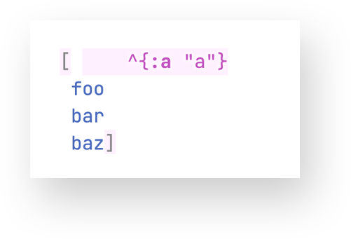

Here is the same vector, with the second symbol in the vector carrying metadata:  

```Clojure
(? ^{:a "a"} ['foo (with-meta (symbol "bar") {:b "b"}) 'baz]
```
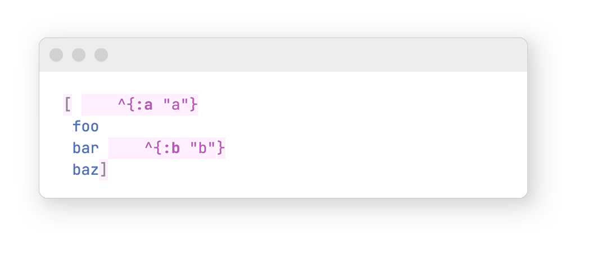

If you would rather print metadata in the traditional "block" position, you can set the config value of `:metadata-positioning` to `:block`:

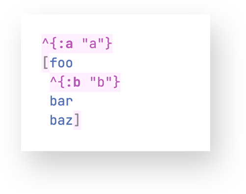


<br>
<br>

### Highlighting values in printed output

Fireworks offers a `:find` option which takes a map containing a `:pred` entry. It will highlight any matches in the printed output. 
```Clojure
(def x [1 33 99 777 -16]

(? {:find {:pred #(= % 777)}} x)
```
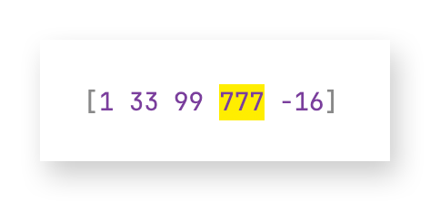


You can also pass a custom highlighting style:

```Clojure
(? {:find {:pred #(= % 777)
           :style {:background-color "#a0f7fd"}}}
   [1 33 99 777 -16])
```
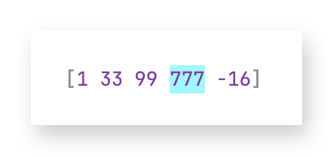


Or pass multiple preds, with different styles:
```Clojure
(? [1 33 99 777 -16]
   {:find [{:pred #(= % 777)}
           {:pred #(= % -16)
            :style {:background-color "#a0f7fd"}}]})
```


<br>
<br>

## Theming

Fireworks includes a [handful of popular themes](#all-the-options). Making your own to perfectly match your current editor theme is straightforward.

If you would like to make your own theme for use with Fireworks, check out `docs/example-theme.edn`. Notice how any of the keys in the `:classes` entry will act as a variable if the same keyword is used as a value in any of the other entries within the `:classes`, `:syntax`, or `:printer` maps.

For your own theme, you do not need to dictate every value that is present in the `:theme` map within the example (`docs/example-theme.edn`). For example, in the default `"Alabaster Light"`, you can see how just a small handful of the tokens are specified. Internally, this gets merged with the base light theme, which specifies how most of the other values inherit from the basic classes in `:classes`. 
```Clojure
{:name    "Alabaster Light"
 :desc    "Based on @tonsky's Alabaster theme."
 :mood    :light
 :langs   ["Clojure" "ClojureScript" "Babashka"]
 :theme   {:classes {:string     {:color "#448C27"}
                     :comment    {:color "#AA3731"
                                  :font-style :italic}
                     :constant   {:color "#7A3E9D"}
                     :definition {:color "#4d6dba"}
                     :annotation {:color "#999999"}}
           :printer {:function-args {:color "#999999"}}}}
```

<br>

The simplest way to make a theme is to just start experimenting within any namespace in your project:
<!-- TODO FILL this out more -->
```Clojure
(def my-theme
 {:name "Foo Dark" ;; Required. Name validated with: #"^[A-Z][^\t\n\r]+ (:?Dark|Light)$"
  :mood "dark"     ;; Required. "light" or "dark"
  :theme {:classes {:string {:color "#c7e62e"}}
          :syntax  {:js-object-key {:color "#888888"}}
          :printer {:function-args {:color "#bb8f44"}}}})

;; And then just try it out with some kind of sample value like this:
(p {:theme my-theme}
   {:string-sample  "string"
    :number-sample  1234
    :boolean-sample true
    :lamda-sample   #(inc %)
    :fn-sample      juxt
    :regex-sample   #"^hi$"
    :symbol-sample  'mysym})
```
   
Tweak the colors to your liking, save the theme as an `.edn` file somewhere on your computer, then set that path as the value of the `:theme` entry in your `.edn` config.

For a token's `:color` or `:background-color`, the value must be a string which is a valid css hex(a) color. This hex will be used for both browser dev consoles and terminal consoles. Your terminal must support 24bit (TrueColor) , and you must explicitly set `:enable-terminal-truecolor?` to `true` in order for the colors to render as expected. If you are using a terminal that does not support 24bit color, such as the Terminal app on macOS, and Fireworks config option `:enable-terminal-truecolor?` is set to `false` (which is default), the specified hex color will automatically get converted to its closest `x256` equivalent.


<br>
<br>

## Aligning your console background color and font
Fireworks can only color the foreground and background of "spans" of text. If you want to perfectly match the themed experience of your source code editor, you will need to manually set the font-family and background color of your terminal emulator and/or browser dev console.

<br>

### Setting the background color and font in Chrome DevTools 
If you are using Firefox, ignore this section and follow [the instructions in the following section](#setting-the-background-color-and-font-in-firefox-developer-tools).

First, you will need to set the general appearance of your Chrome browser's DevTools UI to "Light" or "Dark", depending on whether you are using a light or dark Fireworks theme. This can be done by opening DevTools on any page, clicking the **Settings** gear icon button, and then **Preferences** > **Appearance** > **Theme**. Official instructions <a href="https://developer.chrome.com/docs/devtools/settings" target="_blank">here</a>.


Chrome does not offer direct options in the UI to set the exact background color or font-family of the console in dev tools. To make this simple, I created an extension called <a href="https://chromewebstore.google.com/detail/kjkmaoifmppnclfacnmbimcckfgekmod" target="_blank">DevTools Console Customizer</a>, available via <a href="https://chromewebstore.google.com/detail/kjkmaoifmppnclfacnmbimcckfgekmod" target="_blank">The Chrome Web Store</a>. The project page is <a href="https://github.com/paintparty/devtools-console-customizer" target="_blank">here</a>.

After making a change with this extension, you will need to close and reopen DevTools. If you are switching from a light to dark theme or vice-versa, remember to also reset the general appearance of DevTools in **Settings** > **Preferences** > **Appearance** > **Theme**, as described above.


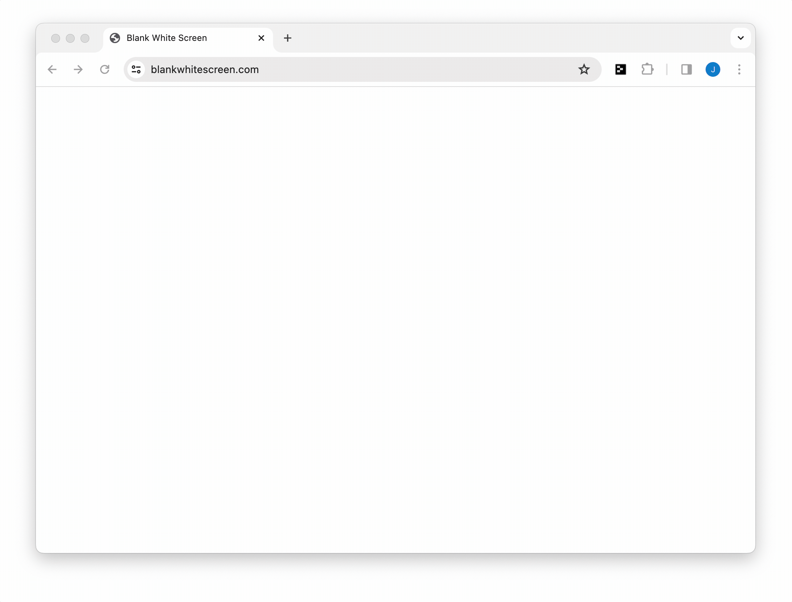

<br>

### Setting the background color and font in Firefox Developer Tools
In Firefox, this can be done by opening Firefox Developer Tools on any page, just right-click and select **Inspect**. Then click on the *`•••`* button in the top right of this panel and select **Settings** to get to the Settings panel. You should see a **Themes** section which will let you select `Light` or `Dark`.


You can customize the font-family and background color of the dev console in **Firefox**, although this has to be done manually. Fireworks provides <a href="" target="_blank">a starter **`userContent.css`** file</a> to make this easy. You will need to place this file in the correct directory on your computer so that Firefox can read it when it launches. Follow the <a href="https://www.userchrome.org/how-create-userchrome-css.html" target="_blank">instructions outlined here</a> to locate this directory. Please note that file, which is necessary file for customizing the Developer Tools console in FireFox, is called `userContent.css`,  ***NOT*** `userChrome.css` (as mentioned in the linked tutorial).  You can put this in the proper directory as explained in the <a href="https://www.userchrome.org/how-create-userchrome-css.html" target="_blank">linked tutorial</a> and change it as needed to align with your chosen theme. Remember to quit and restart Firefox if you make any changes or updates to this `userContent.css` file.


<br>

### Setting the background color and font-family of your terminal emulator
Most terminal emulators have preferences which allow you to change, among other things, the default font-family, background color, and foreground color. Below is a list of the **background colors** of all the stock Fireworks themes:

```
"Alabaster Light" #f7f7f7
"Alabaster Dark"  #0e1415
"Neutral Light"   #ffffff
"Neutral Dark"    #000000
"Degas Light"     #f5f9f9
"Degas Dark"      #363f4e
"Zenburn Light"   #f9f8f5
"Zenburn Dark"    #3f3f3f
"Solarized Light" #fdf6e3
"Solarized Dark"  #002b36
"Monokai Light"   #ffffff
"Monokai Dark"    #2d2a2e
```

If you are using a custom theme with Fireworks, you will probably want to use the background color for that custom theme.

<br>

### Setting the foreground color of your terminal emulator
For theming parity between your editor and terminal emulator, this is probably not as important as setting the background color as described above. However, setting the foreground color will most likely improve your experience as it will ensure that the default foreground color of all other things printed (but not formatted with fireworks) to standard out will jive with the Fireworks theme you are using. Below is a list of the **foreground colors** of all the stock Fireworks themes:

```
"Alabaster Light" #585858
"Alabaster Dark"  #cecece
"Neutral Light"   #585858
"Neutral Dark"    #cecece
"Degas Light"     #585858
"Degas Dark"      #cecece
"Zenburn Light"   #666666
"Zenburn Dark"    #cecece
"Solarized Light" #666666
"Solarized Dark"  #999999
"Monokai Light"   #585858
"Monokai Dark"    #cecece
```

<br>
<br>

## Printing conventions

The following sections are comparisons of various default printing conventions (`clojure.pprint/pprint` vs `js/console.log` vs `fireworks.core/?`).

<br>

#### Printing maps with data structures as keys
When printing maps that contain keys which are data-structures, `clojure.pprint/pprint` sometimes prints these collections keys on their own line, sometimes not. The resulting printed map can be very difficult to comprehend at a glance: 

```Clojure
;; Example map with data structures as keys

{["abcdefghijklmnopqrstuvxyz" "ABCDEFGHIJKLMNOPQRSTUVXYZ"]
 "vector",

 :b
 "keyword",

 {:a "abcdefghijklmnopqrstuvxyz", :b "ABCDEFGHIJKLMNOPQRSTUVXYZ"}
 "map", 

 "d"
 "string"

 #{1 2 3}
 "set"}

=>

;; clojure.pprint/pprint output of above map

{["abcdefghijklmnopqrstuvxyz" "ABCDEFGHIJKLMNOPQRSTUVXYZ"]
 "vector",
 :b "keyword",
 {:a "abcdefghijklmnopqrstuvxyz", :b "ABCDEFGHIJKLMNOPQRSTUVXYZ"}
 "map", 
 "d" "string"
 #{1 2 3} "set"}
```
<br>

Fireworks will always print these maps consistently - every key on its own line & empty line between all entries:

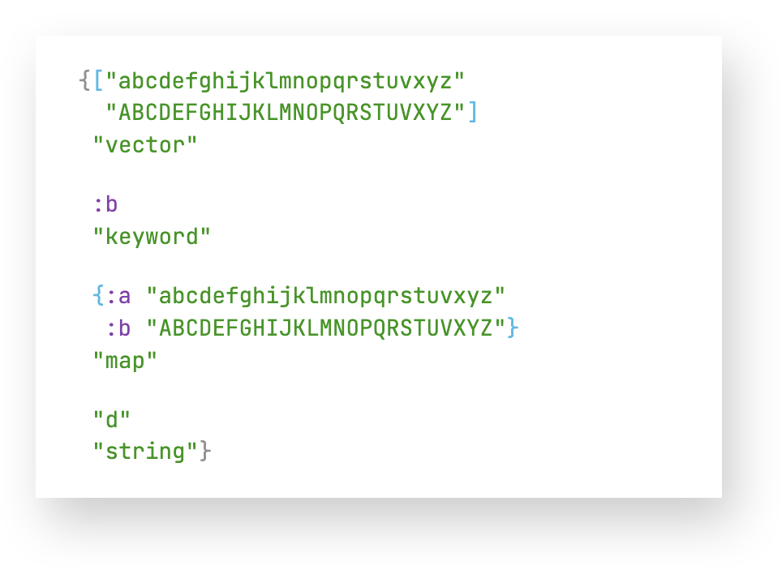

<!-- ```
;; fireworks output

{["abcdefghijklmnopqrstuvxyz"  "ABCDEFGHIJKLMNOPQRSTUVXYZ"]
 "vector"

 :b
 "keyword"

 {:a "abcdefghijklmnopqrstuvxyz"  :b "ABCDEFGHIJKLMNOPQRSTUVXYZ"}
 "map"
 
 "d"
 "string"}
``` -->

<br>

#### Printing functions in ClojureScript

Some sample functions:
```
(ns sandbox.browser)

(defn ab [x y] (+ x y))

(defn abc 
  ([x y] (+ x y))
  ([x y v] (+ x y v)))

(defn my-function-with-a-really-long-name
  [x y z]
  (+ x y z))

(def to-be-printed [ab abc my-function-with-a-really-long-name])
```

`clojure.pprint/pprint` will print the above sample `to-be-printed` vector of fns like this:
```
[#object[sandbox$browser$ab]
 #object[sandbox$browser$abc]
 #object[sandbox$browser$my_function_with_a_really_long_name]]
```

`js/console.log` will print something like this (differs by browser console):
```

[ƒ sandbox$browser$ab(x,y){
  return (x + y);
 },
 ƒ sandbox$browser$abc(var_args){
  var G__901213 = arguments.length;
  switch (G__901213) {
  case 2:
  return sandbox.browser.abc.cljs$core$IFn$_invoke$arity$2((arguments[(0)]),(arguments[(1)]));
  break;
  case…,
 ƒ sandbox$browser$my_function_with_a_really_long_name(x,y,z){
  return (x + y + z);
 }
```

<br>
Fireworks:

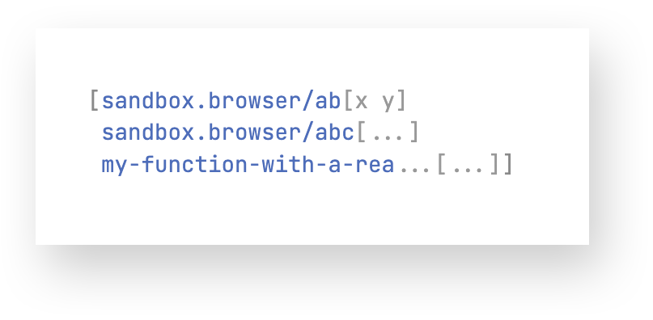

<!-- ```
sandbox.browser/ab[x y]

sandbox.browser/abc[var_args]

my-function-with-a-rea...[...]
``` -->

By default, Fireworks will print the function name with the fully-qualified namespace. This can be disabled by changing the config option `:display-namespaces?` to `false`.

If the fully-qualified name of the function + args vector exceeds the value of `:non-coll-length-limit`, the args will get ellipsized, the namespace will be dropped (if necessary), and the function name will be ellipsized (if necessary).

<br>

#### Printing functions in Clojure

Fireworks prints functions in Clojure the same way as it does in ClojureScript, except that the named args of the function are not available to be printed in the args vector.

<br>

#### Printing built-in JavaScript objects and functions (ClojureScript)

Example vector of built-in JS Functions and Constructors:
 ```
(def built-ins
  [js/decodeURI
   js/isFinite
   js/EvalError
   js/Date]
```
`clojure.pprint/pprint` result:
```
[#object[decodeURI]
 #object[isFinite]
 #object[EvalError]
 #object[Date]]
```

`js/console.log` result:
```
[f decodeURI() {[native code]}
 f isFinite() {[native code]}
 f EvalError() {[native code]}
 f Date() {[native code]}]
```
Fireworks:

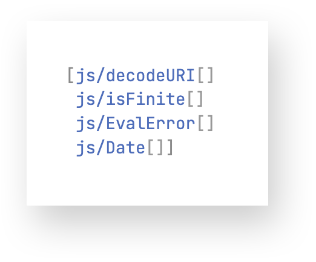

<br>

JS built-in objects such as `js/Math` or `js/JSON` which cannot be called like functions or constructors are printed like this:

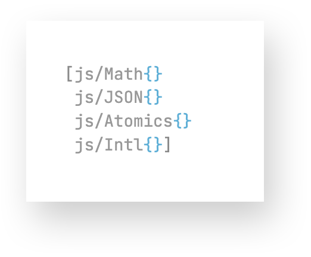

<br>

## Performance

Meaningless performance test: `fireworks.core/?` vs `clojure.pprint/pprint` in JVM Clojure, printing a map of a dozen entries of various data types (found at `fireworks.smoke-test/basic-samples`).

```
Hardware:  Mac Mini
Processor: 3GHz 6-Core Intel
Memory:    16GB 2667 MHz DDR4
```

The test was run using the excellent <a href="https://github.com/taoensso/tufte" target="_blank">**`taoensso.tufte`**</a> library:

```
pId         nCalls   Min   Max    Mean  MAD    Clock   Total

:fireworks  1,000    5ms   19ms   6ms   ±10%   6.33s   49%
:pprint     1,000    6ms   11ms   7ms   ±9%    6.58s   51%
```
Even with all the specific formatting and syntax colorization, the performance of printing values with Fireworks in JVM Clojure is basically on par with `clojure.pprint/pprint`.

<br>

## Status / Roadmap
Alpha, subject to change. Currently, the enhanced interop reflection / print handling is focused more on the ClojureScript side. It would be nice to add more support for native Java types and data structures. Issues welcome, see [contributing](#contributing).

<br>

## Contributing
Issues for bugs, improvements, or features are very welcome. Please file an issue for discussion before starting or issuing a PR.


<br>

## Alternatives 

Discovery:<br>
[FlowStorm](https://www.flow-storm.org/), [Reveal](https://vlaaad.github.io/reveal/), [Portal](https://github.com/djblue/portal).

Serialization:<br>
[pp](https://github.com/eerohele/pp), [fipp](https://github.com/brandonbloom/fipp), [zprint](https://github.com/kkinnear/zprint).

Debugging, tracing, observability:<br>
[playback](https://github.com/gnl/playback),
[debux](https://github.com/philoskim/debux),
[hashp](https://github.com/weavejester/hashp),
[telemere](https://github.com/taoensso/telemere),
[ken](https://github.com/amperity/ken) 
[spyscope](https://github.com/dgrnbrg/spyscope),
[omni-trace](https://github.com/cyrik/omni-trace),
[postmortem](https://github.com/athos/postmortem),
[sayid](https://github.com/clojure-emacs/sayid),


Visualization:<br>
[coll-pen](https://github.com/dscarpetti/coll-pen),
[pp-grid](https://github.com/rorokimdim/pp-grid)

<br>

## License

Copyright © 2024 Jeremiah Coyle

This program and the accompanying materials are made available under the
terms of the Eclipse Public License 2.0 which is available at
http://www.eclipse.org/legal/epl-2.0.

This Source Code may also be made available under the following Secondary
Licenses when the conditions for such availability set forth in the Eclipse
Public License, v. 2.0 are satisfied: GNU General Public License as published by
the Free Software Foundation, either version 2 of the License, or (at your
option) any later version, with the GNU Classpath Exception which is available
at https://www.gnu.org/software/classpath/license.html.
