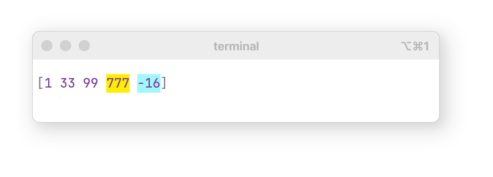

<p align="center"><sub>Many thanks to <a href="https://www.clojuriststogether.org/">Clojurists Together</a> for generously supporting this project!</sub></p>

<div align="center"></img></div> 
<p align="center">
<a href="https://clojars.org/io.github.paintparty/fireworks">
</img>
</a>
</p>

<br>


<div align="center">

**[Features]**  &nbsp;•&nbsp; **[Setup]**  &nbsp;•&nbsp;  **[Editors]**  &nbsp;•&nbsp;  **[Usage]** &nbsp;•&nbsp; **[Modes]** &nbsp;•&nbsp;  **[Options]** &nbsp;•&nbsp; **[Theming]** &nbsp;•&nbsp; **[Interop]**
</div>

[Features]:     #features
[Setup]:        #setup
[Editors]:      #editor-integrations
[Usage]:        #usage
[Modes]:        #tap-driven-development
[Options]:      #options
[Theming]:      #theming
[Interop]:      #printing-conventions


<br>
<br>
<br>
<br>

<p align="center"><sub><b>Fireworks (Alabaster Dark) + Clojure + lein-test-refresh + integrated terminal + VSCode Joyride user script</b></sub></p>
<p align="center">
  
  </img>
</p>
<br>
<p align="center"><sub><b>Fireworks (Alabaster Light) + Clojure + lein-test-refresh + integrated terminal + VSCode Joyride user script</b></sub></p>
<p align="center">
  
  </img>
</p>

<br> 
<br>

## Features

- Prints values without altering the execution of your program.

- Editor integrations for [Cursive](https://github.com/paintparty/fireworks/blob/main/docs/editors/cursive/cursive.md) & [VSCode](https://github.com/paintparty/fireworks/blob/main/docs/editors/vscode/vscode.md).

- Achieve thematic parity between editor, terminal emulator, and browser dev console.

- Customizable via system-wide `.edn` config file.

- Novel typographic approach for printing metadata inline, alongside values.

- Truncation of collections and long values such as strings.

- Left-justification of values in maps.

<!-- - Trace values in `let` bindings and threading macros such as `->`. -->
<!-- - Trace values in threading macros such as `->`, `->>`, `some->`, `some->>`. -->

- Optional rainbow brackets, in high or low contrast.

- Makes cljs color printing possible in all dark-mode-themed browser consoles. 

- Enhanced reflection for JS and Java values.

- Say goodbye to mysterious things like `#[Object #[Object]]`

- Find and highlight values in printed output.

- Call site options let you easily try out different themes and formatting options.

- Ships with several popular themes in light and dark variants.

<br>

## Setup

Requires Clojure `1.10.3` or higher

If using with Babashka, requires Babashka `v1.12.196` or higher

<br>

### Step 1:

Add as a dependency to your project:


```clojure
[io.github.paintparty/fireworks "0.17.0"]
```

<br>

### Step 2:

Import into your namespace, config, and start using:

```clojure
(ns myns.core
  (:require
    [fireworks.core :refer [? !?]]))

;; Chose a theme below based on your terminal theme
;; You don't need to use config! like this if you set
;; up a system-wide config.

(fireworks.core/config!
 {
  :theme "Universal Neutral"
  ;; :theme "Alabaster Light"
  ;; :theme "Alabaster Dark"
  ;; :theme "Neutral Light"     
  ;; :theme "Neutral Dark"      
  ;; :theme "Degas Light"       
  ;; :theme "Degas Dark"        
  ;; :theme "Zenburn Light"     
  ;; :theme "Zenburn Dark"      
  ;; :theme "Solarized Light"   
  ;; :theme "Solarized Dark"    
  ;; :theme "Monokai Light"     
  ;; :theme "Monokai Dark"      
  :display-metadata? true})

(def sample
     {:string  "hi"	
      :int     1111
      :keyword :hi	
      :regex   "^hi$"
      :boolean true	 
      :symbol  (with-meta 'mysym {:foo :bar})
      :vector  [1 2 3]
      :set     #{1 3 2}
      :map     {:a 2 :b 3}
      :seq     (map inc (range 3))
      :date    (java.util.Date.)})

(? sample)
```

<br>

## Setting up a system-wide config

Optional, but highly recommended if you are going to be using Fireworks across
different projects, and you want to set your default printing options and
preferred theme (on your machine, for your eyes only) in one place. 

### Step 1:

Add a [system-wide config file](#system-wide-config) at `/Users/<your-home-folder>/.config/bling/config.edn` (suggested path). You will need to substitute `<your-home-folder>` in the example above with the name of your user folder on your computer. There are a [bunch of options](#all-the-options), but at minimum you'll probably want to specify a light or dark stock theme:

```Clojure
 {:theme "Alabaster Light"
  ;; :theme "Alabaster Dark"    
  ;; :theme "Neutral Light"     
  ;; :theme "Neutral Dark"      
  ;; :theme "Degas Light"       
  ;; :theme "Degas Dark"        
  ;; :theme "Zenburn Light"     
  ;; :theme "Zenburn Dark"      
  ;; :theme "Solarized Light"   
  ;; :theme "Solarized Dark"    
  ;; :theme "Monokai Light"     
  ;; :theme "Monokai Dark"
  ;; :theme "Universal Neutral" ; works with both light and dark bg
  }
```

Fireworks automatically checks the color support level of the environment and
will use truecolor (16m colors) for level `3`, or 8bit (x256) for level `2`. If
color level `1` is detected, a black & white theme ("Universal Neutral") is used.

Most terminal-emulators support truecolor (16m colors). You can check support by pasting this into your terminal:

```
echo -e "\033[1;38;2;255;0;0mRED\033[0m \033[1;38;2;0;255;0mGREEN\033[0m \033[1;38;2;0;0;255mBLUE\033[0m \033[1;38;2;255;255;0mYELLOW\033[0m"
```

If the words in the resulting output are not colored red, green, blue, and yellow, then your terminal does not support truecolor.

You can explicitly set the color level support by setting the
`:supports-color-level` config option to `1`, `2`, or `3`.

<br>

### Step 2:

Add a [system-wide environmental variable](#system-wide-config) in the right place (in your `.zshrc` or similar), to let Fireworks know where to find your config:

```Clojure
export BLING_CONFIG="/Users/<your-home-folder>/.config/bling/config.edn"
```
<br>

### Step 3:

Align your terminal and/or browser dev console background color with the
Fireworks theme you are using. See
[this section](#aligning-your-console-background-color-and-foreground-color) for
details.

<br>
<br>

## Two libraries

In development, use the `io.github.paintparty/fireworks` library.

For production builds, use the [`io.github.paintparty/fireworks-stubs`](https://github.com/paintparty/fireworks-stubs) library. The API is identical to `fireworks` but the macros don't print anything - they just expand to the original form itself. This way, you don't have to worry about production code that contains tapping/debugging code that you forgot to remove.

<br>
<br>

## Hot-reloaded workflow

Fireworks is a great fit for a hot-reloaded, tap-driven-dev style workflow.

For many ClojureScript projects using something like Shadow-cljs, this is the norm.

For this kind of workflow on JVM Clojure, there are 2 sample setups in `examples/test-refresh/` directory. One is a `deps.edn` project and the other is a Leiningen project. Both of these projects use [test-refresh](https://github.com/jakemcc/test-refresh), with the `:debug` option set to `true`.

### JVM Clojure Deps Setup
From the root of `examples/test-refresh/deps-project` run `clojure -M:test-refresh`. Open the `example.hello` namespace and play around with the examples. Checkout the `.test-refresh.edn` file for notes on the options that are specific to this kind of hot-reload workflow. More info about how test-refresh works for `deps.edn` projects can be found [here](https://github.com/jakemcc/test-refresh/blob/master/docs/deps_edn.md).

### JVM Clojure Leiningen Setup
From the root of `examples/test-refresh/lein-project` run `lein test-refresh`. Open the `example.hello` namespace and play around with the examples. Checkout the `.test-refresh.edn` file for notes on the options that are specific to this kind of hot-reload workflow. More info about how test-refresh works for Leiningen projects can be found [here](https://github.com/jakemcc/test-refresh/blob/master/docs/leiningen.md).

You can also add relevant entries from the sample `project.clj` to your `~/.lein/profiles.clj`, to make them available globally on your system:
```Clojure
{:user         {:plugins [[com.jakemccrary/lein-test-refresh "0.26.0"]]}
 :test-refresh {:quiet             true
                :notify-on-success false
                :changes-only      true

                ;; The :debug option, if set to true, will skip all tests, but still reloads
                ;; namespaces that have changed. This is a nice way to spin up a hot-reload dev
                ;; environment for tap-driven development with Fireworks in JVM Clojure.
                ;; If you want to run tests on every refresh, just set this back to the default
                ;; value of false.
                :debug             true

                ;; With a hot-reload workflow, it is nice to use a simple custom banner.
                :banner            "🔥🔥🔥🔥🔥🔥🔥🔥🔥"

                ;; With a hot-reload workflow, it is nice to clear the terminal on refresh. 
                :clear             true}
```
<br>
<br>

## Editor Integrations

These integrations allow you to quickly wrap and unwrap forms with a shortcut,
as well as toggle the silencing of wrapped forms.

#### [IntelliJ IDEA + Cursive](https://github.com/paintparty/fireworks/blob/main/docs/editors/cursive/cursive.md)
#### [VSCode + Joyride](https://github.com/paintparty/fireworks/blob/main/docs/editors/vscode/vscode.md)


<br>
<br>

## Usage
This section outlines the four public macros that fireworks offers:<br>
**`?`**, **`!?`**, **`?>`**, and **`!?>`**.

<br>

**`fireworks.core/?`** is a macro that prints the form, namespace info, and resulting value. It returns the resulting value.

```Clojure
(def x {:a "foo" :xyz "bar"})

(? x)
```
<p align="center"></p>


Calling **`fireworks.core/?`** with two arguments will print a label (instead of the form), the namespace info, and the result:

```Clojure
(? "My label" x)
```
<p align="center"></p>

<br>

The first argument can also be a specific flag, in the form of a keyword,
which dictates a mode of functionality (See the table in the following section for more details):

```Clojure
(? :- x)
```
<br>

The first argument can also be a map, which supplies various [config options](#options):

```Clojure
(? {:label      "My label"
    :theme      "Monokai Light"
    :coll-limit 10}
   x)
```

<br>

If you want to use a specific mode and also supply override config options, you can call  **`fireworks.core/?`** with 3 arguments:

```Clojure
;; Passing the `:pp` flag as the first argument will print the value with fireworks.pp/pprint, instead of fireworks formatting.
;; Prints with custom label of "My label", the file info, and returns the result.
(? :pp {:label "my label" :bold? true} x)

;; Passing the `:js` flag as the first argument will print the value with js/console.log, instead of fireworks formatting.
;; Prints with custom label of "My label", the file info, and returns the result.
(? :js {:label "my label" :bold? true} x)

;; Passing the `:-` flag as the first argument will print only the value.
;; Omits form (or custom label) and the file info.
;; Options map override default config options.
;; Returns the result
(? :result {:coll-limit 10} x)

```

<br>

**`fireworks.core/!?`** is a no-op macro that just returns the value. It is intended for situations where you want to temporarily "silence" the printing, because you will likely turn it back on again in the near future.

<br>

**`fireworks.core/?>`** is a macro that sends the form to `clojure.core/tap>`, and then returns the value.

<br>

**`fireworks.core/!?>`** is a no-op that just returns the value. It is intended for situations where you already have a form wrapped with `?>`, and you want to temporarily *not* send it to `clojure.core/tap>`.


<br>

### Tap-driven development
Fireworks prints values from your source without altering the execution of your program. By default, the printed output that Fireworks produces is typographically optimized for speed of comprehension. When printing data structures, the primary goal is to provide the user with a high-level snapshot of the shape and contents of the data. This is often sufficient to enable understanding at glance, and doesn't require the user to switch context and interact with a entirely separate UI that might involve clicking and scrolling around just to look at a single nested value.

Because Fireworks is designed to provide quick, rapid feedback to the terminal or browser dev console, it complements discovery-centric tools with a dedicated UI such as [FlowStorm](https://www.flow-storm.org/), [Reveal](https://vlaaad.github.io/reveal/), or [Portal](https://github.com/djblue/portal).

The `?` macro also provides a bevy of functionality that can be controlled an optional leading keyword flag and/or a map of options. For example, when it is necessary to view a data structure in its entirety, or without any truncation of values, you can pass specific options at the call site, or simply just include `:+`, or `:pp`, or `:js` as the leading argument to **`fireworks.core/?`**.

All the available alternate printing modes for **`fireworks.core/?`** and their behaviors are outlined in the table below. These modes are activated by passing an optional leading keyword flag. Unless noted otherwise, **`fireworks.core/?`** will always return the value passed to it.

<br>

| Mode        | Prints with       | Prints label? | Prints file info? | Returns | Notes |
| :---        | :---              | :---          | :---              | :--     | :--   |
|  none       | Fireworks         | ✓             | ✓                 | value   |       |
| `:-`        | Fireworks         | ×             | ×                 | value   |       |
| `:+`        | Fireworks         | ✓             | ✓                 | value   | No truncation |
| `:no-label` | Fireworks         | ×             | ✓                 | value   |       |
| `:no-file`  | Fireworks         | ✓             | ×                 | value   |       |
| `:js`       | `js/console.log`* | ✓             | ✓                 | value   |       |
| `:js-`      | `js/console.log`* | ×             | ×                 | value   |       |
| `:pp`       | `pp/pprint`       | ✓             | ✓                 | value   |       |
| `:pp-`      | `pp/pprint`       | ×             | ×                 | value   |       |
| `:data`     | N/A               | ×             | ×                 | map     |       |
| `:comment`  | N/A               | ✓             | ✓                 | nil     |       |


<!--TODO put this back in once problems fixed>
<!-- | `:trace`   | Fireworks         | ✓             | ✓                 | Traces `->`, `->>` `some->`, `some->>`.                                              | -->

<br>

Some annotated examples using modes outlined in the above table:

```Clojure

;; Prints just the result. Omits the label and file info.
(? :- (+ 1 1))

;; Prints the file info and the result. Omits the label.
(? :no-label (+ 1 1))

;; Prints the label, file info, and the result. Uses pprint instead of fireworks. 
(? :pp (+ 1 1))

;; Prints a custom label, file info, and the result. Uses pprint instead of fireworks. 
(? :pp "My label" (+ 1 1))
```


### Getting the formatted string & other data

If you just want the formatted string, and/or other data that **`fireworks.core/?`** uses to construct the printed output, you can use the `:data` option.

```Clojure
;; ClojureScript

(? :data "foo")
=>
{:quoted-form "foo",
 :file "my_project/core.cljc",
 :end-column 46,
 :ns-str "my-project.core",
 :file-info-str "my-project.core:17:21",
 :column 21,
 :line 17,
 :end-line 17,
 :formatted {:string "\\033[3;34;mmy-project.core:17:21\\033[0m",
             :string-with-format-specifier-tags "%c\"foo\"%c",
             :css-styles ["color:#448C27;line-height:1.45;"
                          "color:#585858;line-height:1.45;"]},
 :formatted-with-header {:string "\\033[3;34;mmy-project.core:17:21\\033[0m"
                         :string-with-format-specifier-tags "%cmy-project.core:17:21%c\n%c\"foo\"%c %c=>%c %c\"foo\"%c",
                         :css-styles ["color:#8c8c8c;font-style:italic;line-height:1.45;"
                                      "color:#585858;line-height:1.45;"
                                      "color:#448C27;line-height:1.45;"
                                      "color:#585858;line-height:1.45;"
                                      "color:#28cc7d;line-height:1.45;"
                                      "color:#585858;line-height:1.45;"
                                      "color:#448C27;line-height:1.45;"
                                      "color:#585858;line-height:1.45;"]}}
```

<br>
<br>


## Options

Reference map of options and default values, for cutting & pasting:

```Clojure
{:theme                         "Alabaster Light"
 :line-height                   1.45
 :print-level                   7
 :label-length-limit            25
 :format-label-as-code?         false
 :non-coll-length-limit         33
 :non-coll-mapkey-length-limit  20
 :non-coll-result-length-limit  444
 :non-coll-depth-1-length-limit 59
 :single-line-coll-length-limit 15
 :coll-limit                    15
 :display-namespaces?           true
 :metadata-print-level          7
 :display-metadata?             true
 :metadata-position             :inline   ; :inline | :block
 :bracket-contrast              :high     ; :high | :low
 :supports-color-level          nil       ; 1, 2, or 3. 
 :enable-rainbow-brackets?      true}
```

<br>

You can try any of the options out at the call site: 
```Clojure
    (let [sample {:string  "string"
                  :regex   #"myregex"
                  :uuid    #uuid "4fe5d828-6444-11e8-8222-720007e40350"
                  :symbol  'mysym
                  :nesting [[[[[[]]]]]]
                  :vector  (with-meta 
                             ['foo
                              (with-meta 'bar {:meta-on-sym "xyz"})
                              'baz]
                             {:meta-on-coll "abc"})}]

      (? sample)

      (? "Displays metadata on the vector"
       {:display-metadata? true}
       sample)

      (? "The uuid will not be truncated" 
       {:non-coll-length-limit 50}
       sample)

      (? "The nested vector will be truncated" 
       {:print-level 3} 
       sample))
```

<br>

You can also set them globally, in your project, at runtime:
```Clojure
(fireworks.core/config! {:display-metadata?     true
                         :non-coll-length-limit 50
                         :print-level           3})
```

<br>

And you will probably want to set them globally, for your system, via a [system-wide config](#system-wide-config).

<br>

### System-wide config

Fireworks is designed to pick up your preferred theming and formatting options from a system-wide `.edn` config file that lives in a globally accessible place outside of any projects. In order to make this work, you will need to set the environment variable `BLING_CONFIG` to the path of this file.

This naming convention comes from the syntax coloring library (Bling)[https://github.com/paintparty/bling], which depends on fireworks for automatic syntax coloring of data structures to be printed.

This `.edn` config file can live anywhere on your computer, but by convention should be `~/.config/bling/config.edn`. If you were to set the environment variable in your `.zshrc` (or similar), it would look like this: 

```
export BLING_CONFIG="/Users/<your-home-folder>/.config/bling/config.edn"
```

You will need to substitute `<your-home-folder>` in the example above with the name of your user folder on your computer. When you setup this environment variable for the first time, and you are already running a Clojure(Script) project that you aim to use Fireworks in, you will probably need restart a new session from a new terminal instance, so that your new `BLING_CONFIG` env var will be accessible in your dev environment.

For the actual `config.edn` file, you can use the above example map (at the beginning of this section) as a starting point. Prior to doing this you can experiment with the various configuration options ala-carte via passing a leading options map to `fireworks.core/?`:


<br>
<br>

### All the options
All of the available config options and their default values:

<br>

#### **`:theme`**
Defaults to `"Alabaster Light"`<br>

Sets the theme. This will override `:mood` setting.
This must be one of the following 3 types of values:

- A theme name which corresponds to the theme name of an stock fireworks theme in `themes/`. Currently, these include the following:<br><br>
`"Alabaster Light"`<br>
`"Alabaster Dark"`<br>
`"Neutral Light"`<br>
`"Neutral Dark"`<br>
`"Solarized Light"`<br>
`"Solarized Dark"`<br>
`"Degas Light"`<br>
`"Degas Dark"`<br>
`"Zenburn Light"`<br>
`"Zenburn Dark"`<br>
`"Monokai Light"`<br>
`"Monokai Dark"`<br>
`"Universal Neutral"`<br>

- A path pointing to an `.edn` file on your computer, the contents of which constitute a valid fireworks theme.<br>The path must be absolute e.g. `"/Users/<your-home-folder>/.config/bling/my-theme.edn"`<br>
This will not work:
`"~/.config/bling/my-theme.edn"`
<br>If the map in this `.edn` file fails to satisfy the `fireworks.specs.theme/theme` spec it will issue a warning and fall back to the default light or dark theme (depending on the value of `:mood`). 

- A valid Fireworks theme, which is a map that satisfies the `fireworks.specs.theme/theme` spec. Typically, its structure will at minimum resemble the first example found in the [theming section ](#theming) of this document.


<br>


#### **`:line-height`**
Defaults to `1.45`<br>

Sets the line-height. Only takes effect in browser consoles.

<br>

#### **`:coll-limit`**
Defaults to `15`<br>

Sets the max length of collections.  Collections whose count are at least 2 greater than this number will be truncated. By default, Fireworks aggressively truncates collections to keep the display footprint of the printed output as short and narrow as possible.

<br>

#### **`:label-length-limit`**

 Defaults to `25`<br>

Sets the max length of the form-to-be-evaled label, or the user label, if supplied.

<br>

#### **`:format-label-as-code`**

 Defaults to `false`<br>

If a custom label is not supplied, this will pretty-print the form-to-be-printed,
instead of truncating it.

<br>

#### **`:label-color`**

 Defaults to `nil`<br>

Sets the color of the form-to-be-evaled label, or the user label, if supplied.
Valid values are `:blue`, `:green`, or `:red`. All stock themes will have a preset color
that is synced with the particular theme, so this option is intended to be used as an override at the call site if you have multiple printings from different places in your codebase, and you want an easy way to distinguish them from each other. 

<br>

#### **`:print-level`**
 Defaults to `7`<br>

Sets the max depth of printing for nested collections.

<br>

#### **`:non-coll-length-limit`**
 Defaults to `33`<br>

Sets the max length of things like strings, keywords, function names, etc., when they are nested more than one level deep inside a data structure. Values whose length exceeds this will be ellipsized.


<br>

#### **`:non-coll-mapkey-length-limit`** 
Defaults to `20`<br>

Sets the max length of things like strings, keywords, function names, etc., when they are used as keys in maps. Longer values will be ellipsized.


<br>

#### **`:non-coll-result-length-limit`**
Defaults to `444`<br>

Sets the max length of a non-collection value such as a string, keyword, function name, etc. Only applies when the value itself is the result of the evaluation (not nested within a data structure).


<br>


#### **`:non-coll-depth-1-length-limit`**
Defaults to `69`<br>

Sets the max length of a non-collection value such as a string, keyword, function name, etc. Only applies when the value is nested one level deep inside the result, which would be a non-associative collection such as a vector or seq.


<br>

#### **`:enable-rainbow-brackets?`**
Defaults to `true`<br>

Whether or not to use rainbow brackets. Rainbow brackets can be customized in your theme.


<br>

#### **`:bracket-contrast`**
Defaults to `"high"`<br>

Sets the level of rainbow bracket intensity to `"high"` or `"low"`.  Default value can also be overridden by `:bracket-contrast` entry in a Fireworks theme map.


<br>

#### **`:bold?`**
Defaults to `false`<br>

Will render the printed output with a `font-weight` of `bold`.


<br>

#### **`:truncate?`**
Defaults to `true`<br>

Intended primarily to used at the call site when you want to turn off all truncation of collections and all truncation (ellipsis) of self-evaluating values (string, keywords, symbols, etc.). If set to `false`, all truncation will be capped at 1000, meaning 1000 things in a collection and a length of 1000 for self-evaluating values.


<br>

#### **`:display-namespaces?`**
Defaults to `true`<br>

Whether or not to print out fully qualified namespaces for functions and classes. Note that even if set to `true`, namespaces may get dropped if the count of fully qualified symbol exceeds the `:non-coll-length-limit` or the `:non-coll-mapkey-length-limit` (in the case of map keys).

<br>

#### **`:supports-color-level`**

Defaults to `nil`<br>

You should generally not need to set this, as Fireworks automatically detects the host environment's level of color support, and will set this value internally. Most terminal environments support level `3` (truecolor). If set to `2`, Fireworks will convert the hex color values to sgr-rgb codes (x256) for terminal emulators that do not support 24-bit color. If set to `1`, Fireworks will use a b&w theme ("Universal Neutral"). If you find that your host environment's color support level is not being detected, you can set this value explicitly to match a target level of color support.

<br>

#### <!--**`:enable-terminal-italics?`**-->
<!--Defaults to `true`<br>-->

<!--If set to `false`, any theme tokens specified to be italicized will not be italicized. You probably don't want to change this option.-->


<!--<br>-->

#### <!--**`:enable-terminal-font-weights?`**-->
<!--Defaults to `true`<br>-->

<!--If set to `false`, any theme tokens specified to be bold will NOT be bold. You .-->

<!--<br>-->

#### **`:metadata-print-level`** 
Defaults to `6`<br>

Sets the max depth of printing for metadata maps that contain nested collections.

<br>

#### **`:display-metadata?`**
Defaults to `false`<br>

Print metadata values.

<br>

#### **`:metadata-position`** 
Defaults to `"inline"`<br>

Determines position of metadata relative to value that is carrying it. Options are `"inline"` (default), or `"block"`. 

<br>

#### **`:find`** 
Defaults to `nil`<br>

Find and highlight values in the printed output. See [Highlighting values](#highlighting-values-in-printed-output) section.

<br>

#### **`:when`** 

Defaults to `nil`<br>

If supplied, this value should be a predicate. Will only print something if value passes predicate.

<br>

#### **`:print-with`**
Defaults to `nil`<br>

Although more of an edge-case, you can pass a `:print-with` option at the call site if you would like to print the value using a built-in clojure core printing function. The value must be one of `pr`, `pr-str`, `prn`, `prn-str`, `print`, or `println`.

```Clojure
(? {:label      "My label"
    :print-with prn}
   x)
``` 
If you want to print with `pprint` or `js/console.log`, use `(? :pp ...)` or `(? :js ...)`.

<br>
<br>


### Helpful warnings for bad option values

If you happen to pass a bad value for an option, either at the call-site or in your global config, Fireworks will issue an actionable warning:

<p align="center"></p>


## Displaying metadata
By default, Fireworks offers a unique way of printing metadata inline, next to the values which carry them. The intent of this is to spatially and stylistically decouple the metadata from the value to which it is attached. In practice, I find this formatting much faster to comprehend as compared to conventional "block" positioning of the metadata (above the carrying value), especially when working with metadata-heavy code.

For data structures, the metadata map is displayed inline, immediately following the opening bracket. This means that any collection carrying metadata will always be display multi-line, with each value on its own line. Below is an example vector of three quoted symbols:


```Clojure
(? ^{:a "a"} ['foo 'bar 'baz]
```

<p align="center"></p>


Here is the same vector, with the second symbol in the vector carrying metadata:  

```Clojure
(? ^{:a "a"} ['foo (with-meta (symbol "bar") {:b "b"}) 'baz]
```

<p align="center"></p>


If you would rather print metadata in the traditional "block" position, you can set the config value of `:metadata-positioning` to `:block`:


<p align="center"></p>


<br>
<br>

## Highlighting values in printed output

Fireworks offers a `:find` option which takes a map containing a `:pred` entry. It will highlight any matches in the printed output. 
```Clojure
(def x [1 33 99 777 -16]

(? {:find {:pred #(= % 777)}} x)
```
<p align="center"></p>


You can also pass a custom highlighting style:

```Clojure
(? {:find {:pred #(= % 777)
           :style {:background-color "#a0f7fd"}}}
   [1 33 99 777 -16])
```
<p align="center"></p>


Or pass multiple preds, with different styles:
```Clojure
(? {:find [{:pred #(= % 777)}
           {:pred #(= % -16)
            :style {:background-color "#a0f7fd"}}]}
   [1 33 99 777 -16])
```
<p align="center"></p>

<!-- TODO - Add screenshots -->
You can use one of the following predefined highlighting styles via a `:class` entry:

```Clojure
:highlight-underlined
:highlight-error             
:highlight-warning           
:highlight-info              
:highlight-error-underlined  
:highlight-warning-underlined
:highlight-info-underlined
```

```Clojure
(? {:find {:pred #(= % 777)
           :class :error-underlined}}
   [1 33 99 777 -16])
```

<br>


As an alternative to providing a `:pred` entry, you can target the value to be highlighted with a `:path` entry:
```Clojure
(? {:find [{:path [3]}]}
   [1 33 99 777 -16])
```

<br>
<br>

## Theming

Fireworks includes a handful of popular themes:

<div align="center"><sub><b><i>Alabaster Light&nbsp;&nbsp;&nbsp;&nbsp;&nbsp;&nbsp;&nbsp;&nbsp;</i></b></sub></div>
<div align="center"></div>

<div align="center"><sub><b><i>Zenburn Light&nbsp;&nbsp;&nbsp;&nbsp;&nbsp;&nbsp;&nbsp;&nbsp;</i></b></sub></div>
<div align="center"></div>

<div align="center"><sub><b><i>Solarized Light&nbsp;&nbsp;&nbsp;&nbsp;&nbsp;&nbsp;&nbsp;&nbsp;</i></b></sub></div>
<div align="center"></div>

<div align="center"><sub><b><i>Monokai Light&nbsp;&nbsp;&nbsp;&nbsp;&nbsp;&nbsp;&nbsp;&nbsp;</i></b></sub></div>
<div align="center"></div>

<div align="center"><sub><b><i>Degas Light&nbsp;&nbsp;&nbsp;&nbsp;&nbsp;&nbsp;&nbsp;&nbsp;</i></b></sub></div>
<div align="center"></div>

<div align="center"><sub><b><i>Neutral Light&nbsp;&nbsp;&nbsp;&nbsp;&nbsp;&nbsp;&nbsp;&nbsp;</i></b></sub></div>
<div align="center"></div>

<div align="center"><sub><b><i>Universal Neutral (used if no theme is specified)&nbsp;&nbsp;&nbsp;&nbsp;&nbsp;&nbsp;&nbsp;&nbsp;</i></b></sub></div>
<div align="center"></div>


<div align="center"><sub><b><i>Alabaster Dark&nbsp;&nbsp;&nbsp;&nbsp;&nbsp;&nbsp;&nbsp;&nbsp;</i></b></sub></div>
<div align="center"></div>

<div align="center"><sub><b><i>Zenburn Dark&nbsp;&nbsp;&nbsp;&nbsp;&nbsp;&nbsp;&nbsp;&nbsp;</i></b></sub></div>
<div align="center"></div>

<div align="center"><sub><b><i>Solarized Dark&nbsp;&nbsp;&nbsp;&nbsp;&nbsp;&nbsp;&nbsp;&nbsp;</i></b></sub></div>
<div align="center"></div>

<div align="center"><sub><b><i>Monokai Dark&nbsp;&nbsp;&nbsp;&nbsp;&nbsp;&nbsp;&nbsp;&nbsp;</i></b></sub></div>
<div align="center"></div>

<div align="center"><sub><b><i>Degas Dark&nbsp;&nbsp;&nbsp;&nbsp;&nbsp;&nbsp;&nbsp;&nbsp;</i></b></sub></div>
<div align="center"></div>

<div align="center"><sub><b><i>Neutral Dark&nbsp;&nbsp;&nbsp;&nbsp;&nbsp;&nbsp;&nbsp;&nbsp;</i></b></sub></div>
<div align="center"></div>

<div align="center"><sub><b><i>Universal Neutral (used if no theme is specified)&nbsp;&nbsp;&nbsp;&nbsp;&nbsp;&nbsp;&nbsp;&nbsp;</i></b></sub></div>
<div align="center"></div>


Making your own Fireworks theme to perfectly match your current editor theme is straightforward.

If you would like to make your own theme for use with Fireworks, check out `docs/example-theme.edn`. Notice how any of the keys in the `:classes` entry will act as a variable if the same keyword is used as a value in any of the other entries within the `:classes`, `:syntax`, or `:printer` maps.

For your own theme, you do not need to dictate every value that is present in the `:theme` map within the example (`docs/example-theme.edn`). For example, in the default `"Alabaster Light"`, you can see how just a small handful of the tokens are specified. Internally, this gets merged with the base light theme, which specifies how most of the other values inherit from the basic classes in `:classes`. 
```Clojure
(def alabaster-light
  {:name   "Alabaster Light"
   :desc   "Based on @tonsky's Alabaster theme."
   :about  "This is additional documentation. Should support markdown here."
   :url    "url goes here"
   :author "Author Name"
   :langs  ["Clojure" "ClojureScript" "Babashka"]
   :mood   :light
   :tokens {:classes {:background    {:background-color "#f7f7f7"}
                      :string        {:color "#448C27"}
                      :constant      {:color "#7A3E9D"}
                      :definition    {:color "#4d6dba"}
                      :annotation    {:color      "#8c8c8c" 
                                      :font-style :italic}
                      :metadata      {:color            "#be55bb"
                                      :text-shadow      "0 0 2px #ffffff"
                                      :background-color "#fae8fd"}
                      :metadata2     {:color            "#be55bb"
                                      :text-shadow      "0 0 2px #ffffff"
                                      :background-color "#e9e5ff"}
                      :label         {:color            "#4d6dba"
                                      :background-color "#edf2fc"
                                      :text-shadow      "0 0 2px #ffffff"
                                      :font-style       :italic}
                      :eval-label    {:color            "#4d6dba"
                                      :background-color "#edf2fc"
                                      :text-shadow      "0 0 2px #ffffff"
                                      :font-style       :italic}}
            :syntax  {:js-object-key {:color "#888888"}}
            :printer {:file-info     {:color                "#4d6dba"
                                      :font-style           :italic
                                      :padding-inline-start :0ch}
                      :eval-form     :eval-label
                      :comment       {:color            "#2e6666"
                                      :text-shadow      "0 0 2px #ffffff"
                                      :background-color "#e5f1fa"
                                      :outline          "2px solid #e5f1fa"
                                      :font-style       :italic}
                      :function-args {:color "#999999"}
                      :atom-wrapper  :label}}})
```

<br>

The simplest way to make a theme is to just start experimenting within any namespace in your project:
<!-- TODO FILL this out more -->
```Clojure
(def my-theme
 {:name "Foo Dark" ;; Required. Name validated with: #"^[A-Z][^\t\n\r]+ (:?Dark|Light)$"
  :mood "dark"     ;; Required. "light" or "dark"
  :theme {:classes {:string {:color "#c7e62e"}}
          :syntax  {:js-object-key {:color "#888888"}}
          :printer {:function-args {:color "#bb8f44"}}}})

;; And then just try it out with some kind of sample value like this:
(? {:theme my-theme}
   {:string-sample   "string"
    :number-sample   1234
    :boolean-sample  true
    :lambda-sample   #(inc %)
    :fn-sample       juxt
    :regex-sample    #"^hi$"
    :symbol-sample   'mysym})
```

Tweak the colors to your liking, save the theme as an `.edn` file somewhere on your computer, then set that path as the value of the `:theme` entry in your `.edn` config.

For a theme token's `:color` or `:background-color`, the value must be a string which is a valid css hex(a) color. This hex will be used for both browser dev consoles and terminal consoles. If you are using a terminal that is limited to 8-bit (x256) color support, the specified hex color will automatically get converted to its closest 8-bit equivalent.


<br>
<br>

## Aligning your console background color and foreground color
Fireworks can only color the foreground and background of "spans" of text. If you want to perfectly match the themed experience of your source code editor, you will need to manually set the font-family and background color of your terminal emulator and/or browser dev console.


<br>

### Setting the background color and font-family of your terminal emulator
Most terminal emulators have preferences which allow you to change, among other things, the default font-family, background color, and foreground color. Below is a list of the **background colors** of all the stock Fireworks themes:

```
"Alabaster Light" #f7f7f7
"Alabaster Dark"  #0e1415
"Neutral Light"   #ffffff
"Neutral Dark"    #000000
"Degas Light"     #f5f9f9
"Degas Dark"      #363f4e
"Zenburn Light"   #f9f8f5
"Zenburn Dark"    #3f3f3f
"Solarized Light" #fdf6e3
"Solarized Dark"  #002b36
"Monokai Light"   #ffffff
"Monokai Dark"    #2d2a2e
```

If you are using a custom theme with Fireworks, you will probably want to use the background color for that custom theme.

<br>

### Setting the foreground color of your terminal emulator
For theming parity between your editor and terminal emulator, this is probably not as important as setting the background color as described above. However, setting the foreground color will most likely improve your experience as it will ensure that the default foreground color of all other things printed (but not formatted with fireworks) to standard out will jive with the Fireworks theme you are using. Below is a list of the **foreground colors** of all the stock Fireworks themes:

```
"Alabaster Light" #585858
"Alabaster Dark"  #989898
"Neutral Light"   #585858
"Neutral Dark"    #cecece
"Degas Light"     #585858
"Degas Dark"      #cecece
"Zenburn Light"   #666666
"Zenburn Dark"    #cecece
"Solarized Light" #666666
"Solarized Dark"  #999999
"Monokai Light"   #585858
"Monokai Dark"    #cecece
```

<br>

### Setting the background color and font in Chrome DevTools (ClojureScript) 
If you are using Firefox, ignore this section and follow [the instructions in the following section](#setting-the-background-color-and-font-in-firefox-developer-tools).

First, you will need to set the general appearance of your Chrome browser's DevTools UI to "Light" or "Dark", depending on whether you are using a light or dark Fireworks theme. This can be done by opening DevTools on any page, clicking the **Settings** gear icon button, and then **Preferences** > **Appearance** > **Theme**. Official instructions <a href="https://developer.chrome.com/docs/devtools/settings" target="_blank">here</a>.


> [!WARNING]
>
> As of November 18, 2024, The DevTools Console Customizer described below has stopped working in Chrome, most likely [due to changes made in Chrome version 130](https://github.com/paintparty/devtools-console-customizer/issues/1). Hopefully this can be fixed soon.


Chrome does not offer direct options in the UI to set the exact background color or font-family of the console in dev tools. To make this simple, I created an extension called <a href="https://chromewebstore.google.com/detail/kjkmaoifmppnclfacnmbimcckfgekmod" target="_blank">DevTools Console Customizer</a>, available via <a href="https://chromewebstore.google.com/detail/kjkmaoifmppnclfacnmbimcckfgekmod" target="_blank">The Chrome Web Store</a>. The project page is <a href="https://github.com/paintparty/devtools-console-customizer" target="_blank">here</a>.

After making a change with this extension, you will need to close and reopen DevTools. If you are switching from a light to dark theme or vice-versa, remember to also reset the general appearance of DevTools in **Settings** > **Preferences** > **Appearance** > **Theme**, as described above.


<br>

### Setting the background color and font in Firefox Developer Tools (ClojureScript)
In Firefox, this can be done by opening Firefox Developer Tools on any page, just right-click and select **Inspect**. Then click on the *`•••`* button in the top right of this panel and select **Settings** to get to the Settings panel. You should see a **Themes** section which will let you select `Light` or `Dark`.


You can customize the font-family and background color of the dev console in **Firefox**, although this has to be done manually. Fireworks provides <a href="" target="_blank">a starter **`userContent.css`** file</a> to make this easy. You will need to place this file in the correct directory on your computer so that Firefox can read it when it launches. Follow the <a href="https://www.userchrome.org/how-create-userchrome-css.html" target="_blank">instructions outlined here</a> to locate this directory. Please note that file, which is necessary file for customizing the Developer Tools console in FireFox, is called `userContent.css`,  ***NOT*** `userChrome.css` (as mentioned in the linked tutorial).  You can put this in the proper directory as explained in the <a href="https://www.userchrome.org/how-create-userchrome-css.html" target="_blank">linked tutorial</a> and change it as needed to align with your chosen theme. Remember to quit and restart Firefox if you make any changes or updates to this `userContent.css` file.


<br>
<br>

## Printing conventions

The following sections are comparisons of various default printing conventions (`clojure.pprint/pprint`(or `js/console.log`) vs `fireworks.core/?`).

<br>

#### Printing maps with data structures as keys
When printing maps that contain keys which are data-structures, `clojure.pprint/pprint` sometimes prints these collections keys on their own line, sometimes not. The resulting printed map can be very difficult to comprehend at a glance: 

```Clojure
;; Example map with data structures as keys

{["abcdefghijklmnopqrstuvxyz" "ABCDEFGHIJKLMNOPQRSTUVXYZ"]
 "vector",

 :b
 "keyword",

 {:a "abcdefghijklmnopqrstuvxyz", :b "ABCDEFGHIJKLMNOPQRSTUVXYZ"}
 "map", 

 "d"
 "string"

 #{1 2 3}
 "set"}

=>

;; clojure.pprint/pprint output of above map

{["abcdefghijklmnopqrstuvxyz" "ABCDEFGHIJKLMNOPQRSTUVXYZ"]
 "vector",
 :b "keyword",
 {:a "abcdefghijklmnopqrstuvxyz", :b "ABCDEFGHIJKLMNOPQRSTUVXYZ"}
 "map", 
 "d" "string"
 #{1 2 3} "set"}
```
<br>

Fireworks will always print these maps consistently - every key on its own line & empty line between all entries:

<p align="center"></p>

<br>

#### Printing functions in ClojureScript

A sample vector of 3 functions:
```
(ns sandbox.browser)

(defn ab [x y] (+ x y))

(defn abc 
  ([x y] (+ x y))
  ([x y v] (+ x y v)))

(defn my-function-with-a-really-long-name
  [x y z]
  (+ x y z))

(def to-be-printed [ab abc my-function-with-a-really-long-name])
```

`clojure.pprint/pprint` will print the above `to-be-printed` vector of functions like this:
```
[#object[sandbox$browser$ab]
 #object[sandbox$browser$abc]
 #object[sandbox$browser$my_function_with_a_really_long_name]]
```

`js/console.log` will print something like this (differs by browser console):
```

[ƒ sandbox$browser$ab(x,y){
  return (x + y);
 },
 ƒ sandbox$browser$abc(var_args){
  var G__901213 = arguments.length;
  switch (G__901213) {
  case 2:
  return sandbox.browser.abc.cljs$core$IFn$_invoke$arity$2((arguments[(0)]),(arguments[(1)]));
  break;
  case…,
 ƒ sandbox$browser$my_function_with_a_really_long_name(x,y,z){
  return (x + y + z);
 }
```

<br>
Fireworks:

<p align="center"></p>

By default, Fireworks will print the function name with the fully-qualified namespace. This can be disabled by changing the config option `:display-namespaces?` to `false`.

If the fully-qualified name of the function + args vector exceeds the value of `:non-coll-length-limit`, the args will get ellipsized, the namespace will be dropped (if necessary), and the function name will be ellipsized (if necessary).

<br>

#### Printing functions in Clojure

Fireworks prints functions in Clojure the same way as it does in ClojureScript, except that the named args of the function are not available to be printed in the args vector.

<br>

#### Printing built-in JavaScript objects and functions (ClojureScript)

Example vector of built-in JS Functions and Constructors:
 ```
(def built-ins
  [js/decodeURI
   js/isFinite
   js/EvalError
   js/Date]
 ```
Output from `clojure.pprint/pprint`:
```
[#object[decodeURI]
 #object[isFinite]
 #object[EvalError]
 #object[Date]]
```

Output from `js/console.log`:
```
[f decodeURI() {[native code]}
 f isFinite() {[native code]}
 f EvalError() {[native code]}
 f Date() {[native code]}]
```
Output from Fireworks:

<p align="center"></p>


<br>

JS built-in objects such as `js/Math` or `js/JSON` which cannot be called like functions or constructors are printed like this:

<p align="center"></p>


<br>

## Performance

Meaningless performance test: `fireworks.core/?` vs `clojure.pprint/pprint` in JVM Clojure, printing a map of a dozen entries of various data types (found at `fireworks.smoke-test/basic-samples`).

```
Hardware:  Mac Mini
Processor: 3GHz 6-Core Intel
Memory:    16GB 2667 MHz DDR4
```

The test was run using the excellent <a href="https://github.com/taoensso/tufte" target="_blank">**`taoensso.tufte`**</a> library:

```
pId         nCalls   Min   Max    Mean  MAD    Clock   Total

:fireworks  1,000    4ms   19ms   5ms   ±10%   5.20s   46%
:pprint     1,000    5ms   11ms   6ms   ±9%    6.12s   54%
```
Even with all the specific formatting and syntax colorization, the performance of printing the values (in this test) with Fireworks (in JVM Clojure) is on average 1.2x faster than `clojure.pprint/pprint`.

<br>

## Testing

The JVM tests require [leiningen](https://leiningen.org/) to be installed.
```Clojure
lein test
```

Babashka tests:
```Clojure
bb test:bb
```

<br>

## Status / Roadmap
Alpha, subject to change. Currently, the enhanced interop reflection / print handling is focused more on the ClojureScript side. It would be nice to add more support for native Java types and data structures. Issues welcome, see [contributing](#contributing).

Project roadmap docs can be found [here](https://github.com/paintparty/fireworks/blob/main/docs/roadmap)
<br>

## Contributing
Issues for bugs, improvements, or features are very welcome. Please file an issue for discussion before starting or issuing a PR.


<br>

## Alternatives / Prior Art

Discovery:<br>
[FlowStorm](https://www.flow-storm.org/), [Reveal](https://vlaaad.github.io/reveal/), [Portal](https://github.com/djblue/portal).

Serialization:<br>
[pp](https://github.com/eerohele/pp), [fipp](https://github.com/brandonbloom/fipp), [zprint](https://github.com/kkinnear/zprint).

Debugging, tracing, observability:<br>
[playback](https://github.com/gnl/playback),
[debux](https://github.com/philoskim/debux),
[hashp](https://github.com/weavejester/hashp),
[telemere](https://github.com/taoensso/telemere),
[ken](https://github.com/amperity/ken), 
[spyscope](https://github.com/dgrnbrg/spyscope),
[omni-trace](https://github.com/cyrik/omni-trace),
[postmortem](https://github.com/athos/postmortem),
[sayid](https://github.com/clojure-emacs/sayid),
[scope-capture](https://github.com/vvvvalvalval/scope-capture)


Printing and visualization:<br>
[puget](https://github.com/greglook/puget),
[coll-pen](https://github.com/dscarpetti/coll-pen),
[pp-grid](https://github.com/rorokimdim/pp-grid)

<br>

## License

Copyright © 2024-2025 Jeremiah Coyle

This program and the accompanying materials are made available under the
terms of the Eclipse Public License 2.0 which is available at
http://www.eclipse.org/legal/epl-2.0.

This Source Code may also be made available under the following Secondary
Licenses when the conditions for such availability set forth in the Eclipse
Public License, v. 2.0 are satisfied: GNU General Public License as published by
the Free Software Foundation, either version 2 of the License, or (at your
option) any later version, with the GNU Classpath Exception which is available
at https://www.gnu.org/software/classpath/license.html.
