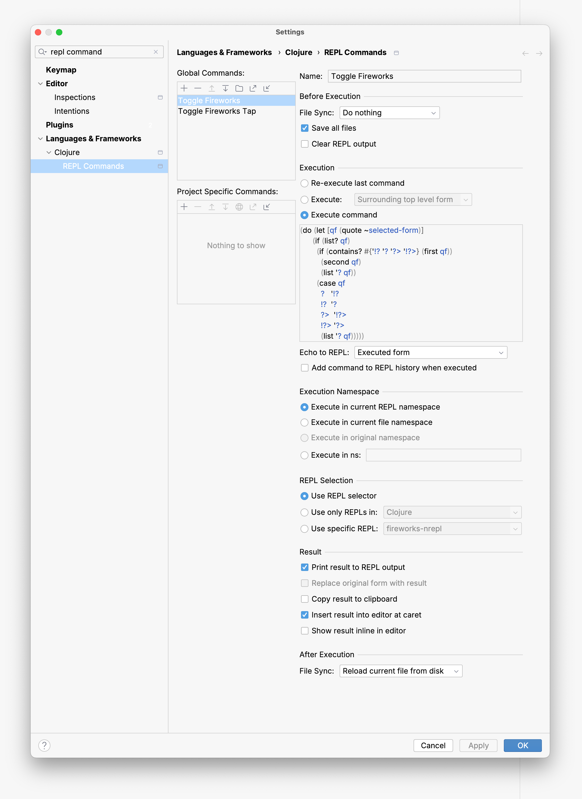
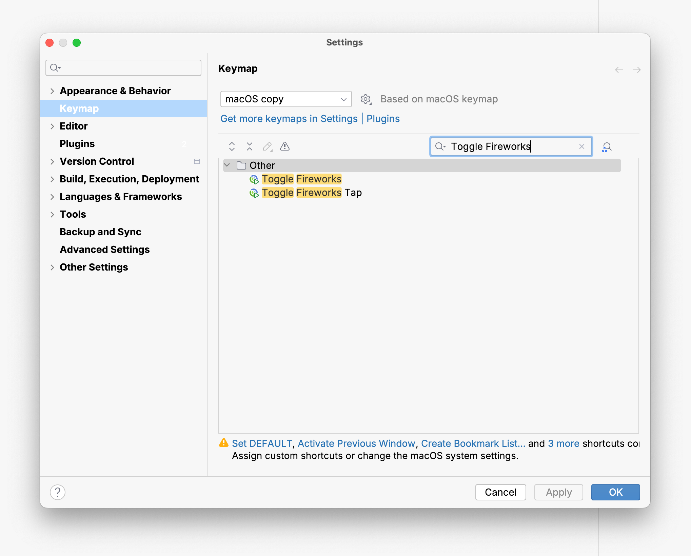
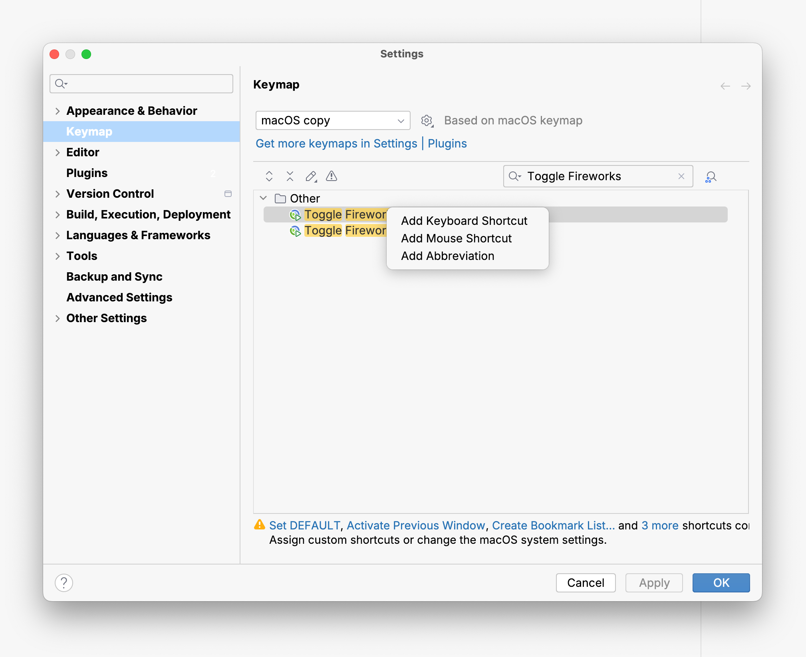

# Using Fireworks with IntelliJ IDEA + Cursive

Requirements: [IntelliJ IDEA Ultimate](https://www.jetbrains.com/idea/) + [Cursive](https://cursive-ide.com/).

<br>

You can optimize the ergonomics of using Firework's print-and-return macros by setting up some REPL Commands. These commands can be bound to the shortcut of your choosing and will execute the wrapping and unwrapping of the form which is selected.

<br>

The **`Toggle Fireworks`** command below will transform `(+ 1 1)` into `(? (+ 1 1))`.
Conversely, it will transform `(? (+ 1 1))` into `(+ 1 1)`.

If the `?` symbol is selected within an existing wrapped form, the **`Toggle Fireworks`**
command will toggle the symbol to `!?` (silent version of `?`), and vice-versa.

<br>

The **`Toggle Fireworks Tap`** command below will transform `(+ 1 1)` into `(?> (+ 1 1))`.
Conversely, it will transform `(?> (+ 1 1))` into `(+ 1 1)`.

If the `?>` symbol is selected within an existing wrapped form, the **`Toggle Fireworks Tap>`**
command will toggle the symbol to `!?>` (silent version of `?>`), and vice-versa.

<br>

### Setting up the commands

<br>

REPL Commands can be configured in:<br>
*Settings* > *Languages and Frameworks* > *Clojure* > *REPL Commands*.

<br>

To set up a **`Toggle Fireworks`** REPL Command:

<br>

1) Add new command in the *Global Commands* list, naming it *Toggle Fireworks*

<br>

2) Paste the following into the code window of the *Execute command* option in the *Execution* section of the REPL Commands settings panel:


```Clojure
(do (let [qf (quote ~selected-form)]
       (if (list? qf)
         (if (contains? #{'!? '? '?> '!?>} (first qf))
           (second qf)
           (list '? qf))
         (case qf
           ?   '!?
           !?  '?
           ?>  '!?>
           !?> '?>
           (list '? qf)))))
```
<br>

3) Configure all the other options in this settings panel to match screenshot below.

<div align="center"></div>

<br>

4) Finally, click on the **Apply** button at the bottom right of the Settings panel.

<br>
<br>

To set up a **`Toggle Fireworks Tap`** REPL Command,
repeat the above 4 steps, giving the command the name *Toggle Fireworks Tap*, and use the following code for the *Execute command* option in the *Execution* section:

```Clojure
(do (let [qf (quote ~selected-form)]
      (if (list? qf)
        (if (contains? #{'!? '? '?> '!?>} (first qf))
          (second qf)
          (list '?> qf))
        (case qf
          ?   '!?
          !?  '?
          ?>  '!?>
          !?> '?>
          (list '?> qf)))))
```

<br>
<br>

### Setting up keybindings

Go to *Settings* > *Keymap*, and search for **Toggle Fireworks** in the search bar on the right side in the ***Keymap*** section:

<div align="center"></div>

<br>
<br>

Right-click on each command and assign it a shortcut:


<div align="center"></div>
