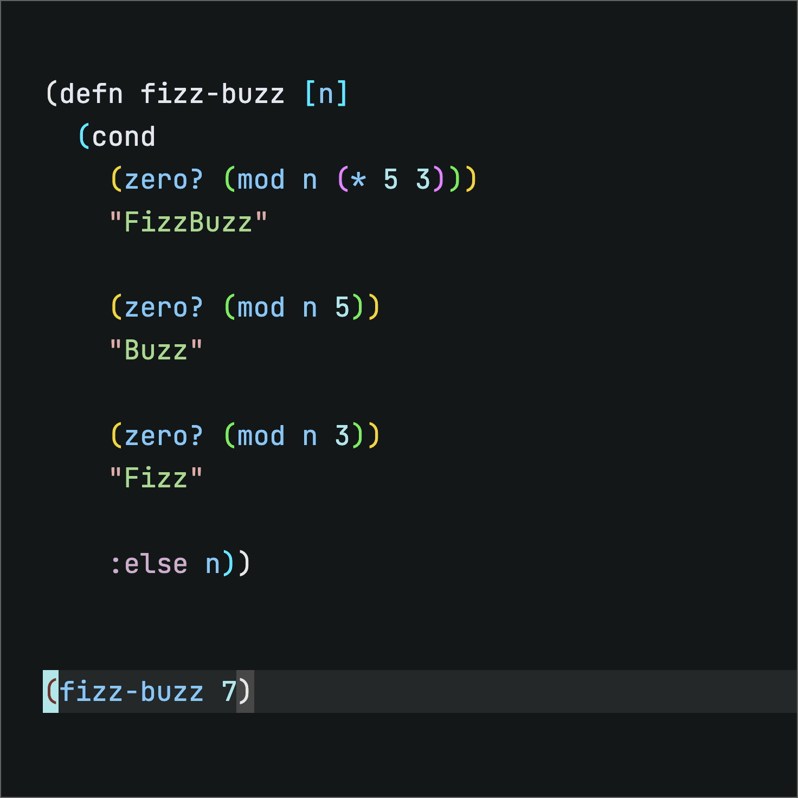
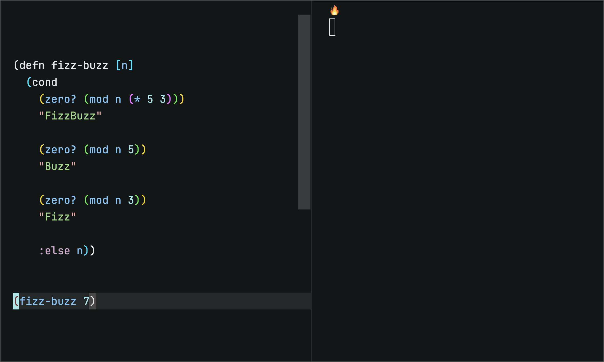
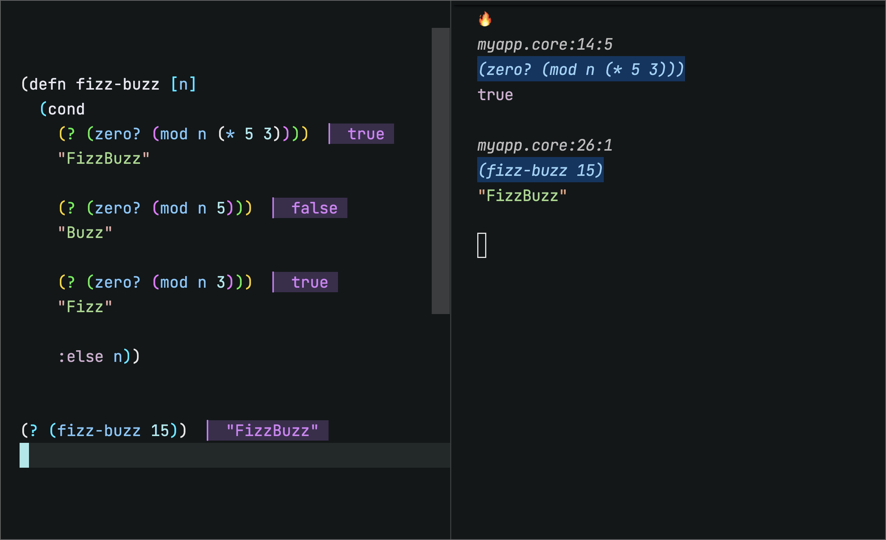
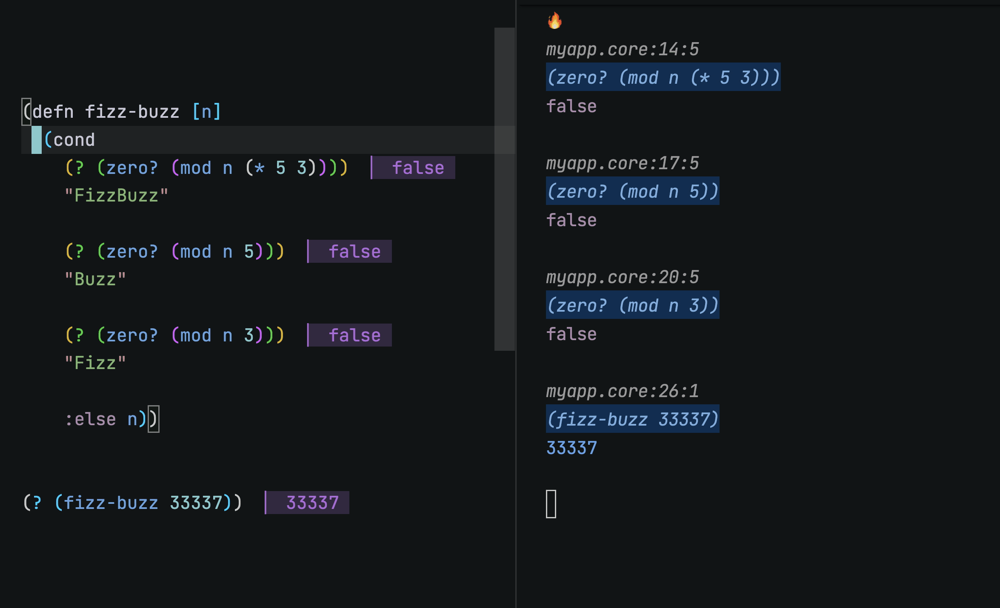
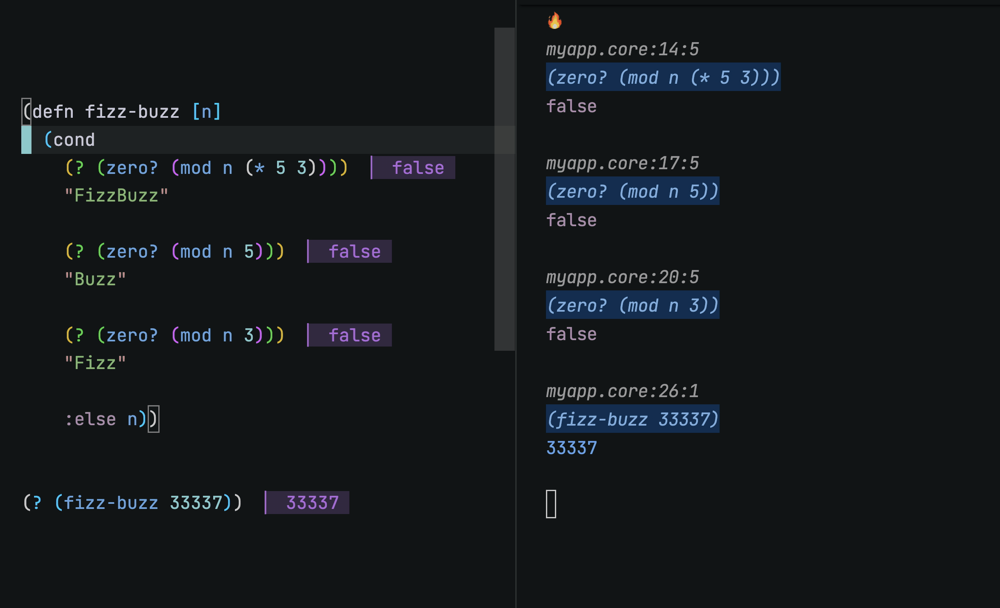
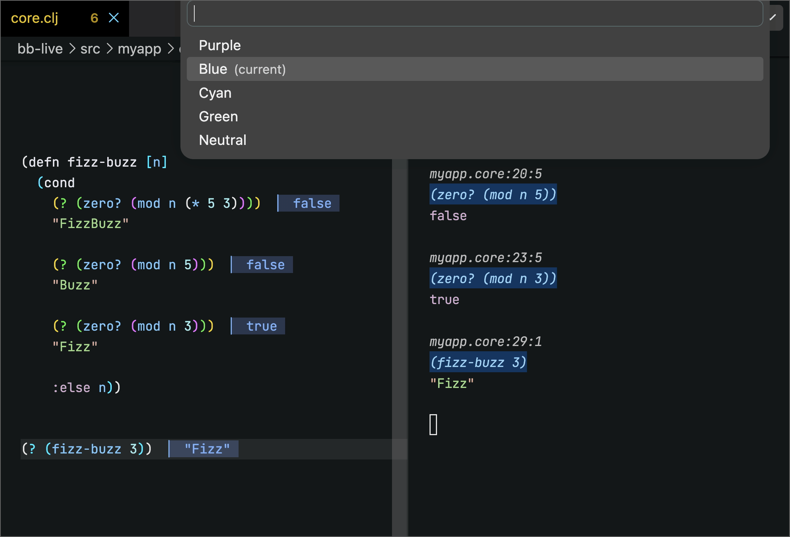
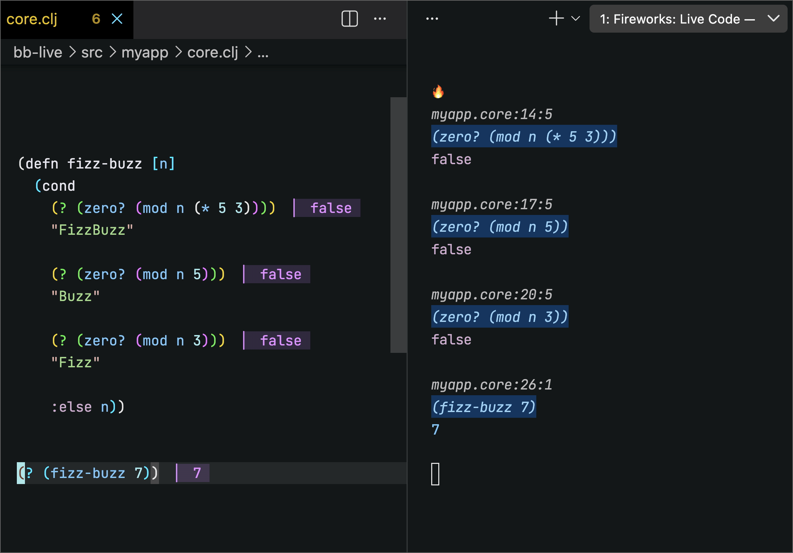
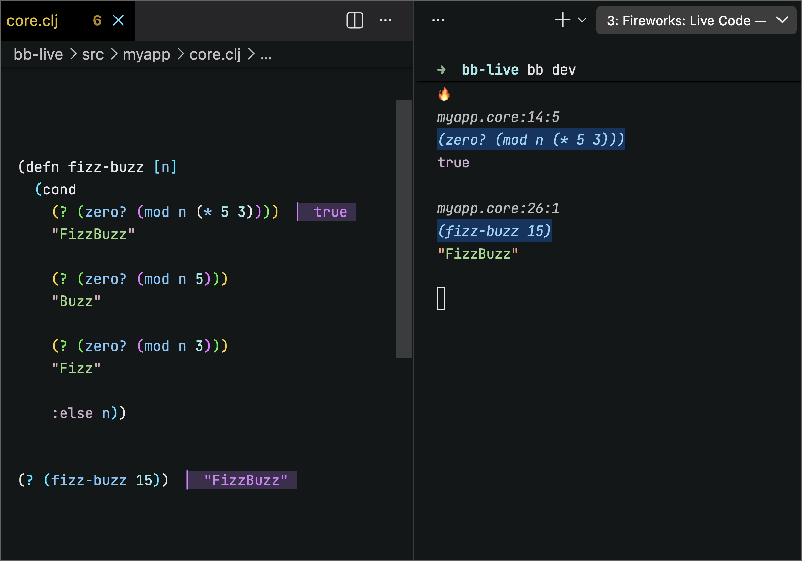
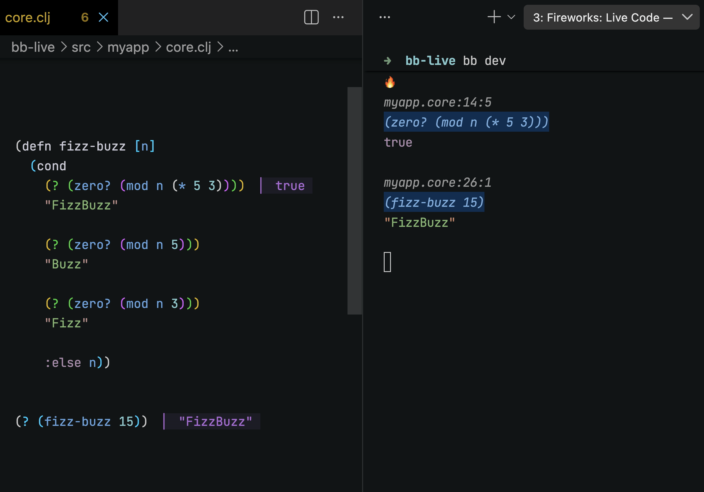

[](https://marketplace.visualstudio.com/items?itemName=jcoyle.fireworks)


# Fireworks VSCode Extension




VS Code extension for [Fireworks](https://github.com/paintparty/fireworks), the live coding library for Clojure, ClojureScript, and Babashka.

This extension provides a suite of commands which fall into 2 main categories:

1) A cohesive set of commands to toggle the different Fireworks macros on forms in your editor. You can operate on one form at a time or several nested forms at a time.

2) Live Code mode activates real-time, inline results of wrapped forms.

<br>

## Install

- In VS Code, open **Extensions** (`cmd/ctrl+shift+X`), search **Fireworks**. Click Install on the result that reads **Fireworks**, *Live Coding for Clojure*.
- Or install from the [Visual Studio Marketplace](https://marketplace.visualstudio.com/items?itemName=jcoyle.fireworks).
- Or from a `.vsix`: **Extensions: Install from VSIX**.


<br>

## Requirements

- Calva (hard dep).
- Java + Node 22+ (for Live Code).

<br>

## Commands

<br>

### Toggle `?`

Wrap form in `?`. Fire it again to unwrap. Default keybinding: `cmd/ctrl + '`.



<br>

### Toggle `?` (loud ↔ silent)

This is the exact same command as above, but it does something different when cursor is on the `?` form itself. It will toggle `?` ↔ `!?` (loud ↔ silent).



<br>

### Unwrap All `?` in Form

Unwrap every Fireworks wrap inside the current form. Works on all the macros: `?`, `!?`, `?>`, `!?>`.



<br>

### Toggle All Silent In Form

Toggle every wrap in the form e.g. `?` ↔ `!?` (loud ↔ silent).




<br>

### Set Inline Results Color 

Pick the inline value Color. Live preview.




<br>

### Set Inline Results Foreground Opacity

Pick the inline value text opacity. Live preview.




<br>

### Set Inline Results Gap

Pick the gap before the inline value. Live preview.




<br>

### Set Inline Results Background Opacity (Dark Theme)

Pick the background tint strength for dark themes. Live preview. (Light theme has its own command.)




<br>

## Live Coding

### Overview
Fire `Fireworks: Live Code`. 

Extension will analyze project roots in workspace and present you with a list of projects eligible projects. Pick one.

Extension will analyze the project's build file, and present you with a list of eligible profiles to choose from.

A build process and file watcher starts running in terminal.

User saves a file, all the `?` forms will re-run and fresh results paint inline.

`Fireworks: Live Code (Stop/Restart)` will reuse same project pick.

<br>

### Clojure Projects
A Clojure project is a candidate for Live Coding if it contains a `deps.edn` or a `project.clj`.

#### Deps Projects

1) Run command `Fireworks: Live Code (Start)`
2) Pick a deps-based project from the quicklist menu.
3) A new quicklist of alias from selected project will appear. Pick an alias from that project.

The Extension will run `clojure -M:<alias>` in terminal. 

You own the alias. It must pull in test-refresh + Fireworks deps. 

The extension also looks for a `.test-refresh.edn` at your project root, then `~/.test-refresh.edn`. No `.test-refresh.edn` anywhere? Extension seeds one from template. 

Save file → watcher re-runs all forms wrapped with`?` → results paint.


#### Leiningen Projects

1) Run command `Fireworks: Live Code (Start)`
2) Pick a Leiningen project from the quicklist menu.
3) A new quicklist of eligible profiles will appear. Pick a profile.

A profile is eligible when it carries the `lein-test-refresh` plugin.

The Extension will run `lein with-profile +<profile> test-refresh` in terminal.

This is the one runtime where the extension may touch your build file. Plugin missing, or the `:test-refresh` map missing? Extension offers to add it. Edits are additive, keep your formatting and comments, and always sit behind a confirm modal.

No profiles at all? Extension takes a read-only look at `~/.lein/profiles.clj` `:user`. Plugin and `:test-refresh` both there? It runs plain `lein test-refresh`. Otherwise it opens a setup guide. Global config is never touched.

Save file → watcher re-runs all forms wrapped with `?` → results paint.

<br>

### Babashka Projects
A Babashka project is a candidate for Live Coding if it contains a `bb.edn` with a task that loads the Fireworks watcher.

1) Run command `Fireworks: Live Code (Start)`
2) Pick a Babashka project from the quicklist menu.
3) A new quicklist of eligible tasks will appear. Pick a task.

A task is eligible when its body runs `(load-file ".fireworks/bb/watch.clj")`. This is how you opt in. A `bb.edn` kept only for build scripts is not mistaken for a watcher.

The Extension will run `bb <task>` in terminal.

If an existing `.fireworks` or `.fireworks/bb/watch.clj` does not existing, the extension seeds `.fireworks/bb/watch.clj` from template (will not overwrite an existing one).

The watcher self-loads the `fswatcher` pod, so no `:pods` entry is needed in your `bb.edn`. It reads optional settings from `.fireworks/config.edn`.

Save file → watcher reloads the file → all forms wrapped with `?` re-run → inline results re-paint.


<br>

## Settings

- TODO: inline result appearance, Live Code options.


<br>

## Developing

Requires Java and Node 22+.

You need two watchers running before launching the F5 host window.

**ClojureScript** — recompiles the cljs library on change:

```
npm run watch-cljs
```

**TypeScript** — recompiles the extension entry point on change:

```
npm run watch-ts
```

After either watcher recompiles, reload the F5 host window (`Developer: Reload Window`) to pick up the changes. A stale host window will silently run old code even if the watcher output looks current.

To run the cljs tests without the watcher:

```
npm run test-cljs
```

Note: `test-cljs` does not rebuild the `:cljs-lib` output that the extension loads. Run `compile-cljs` (or keep `watch-cljs` running) when you need the extension itself updated, not just the tests green.


<br>

## License

EPL-2.0 OR GPL-2.0-or-later WITH Classpath-exception-2.0. © Jeremiah Coyle.
